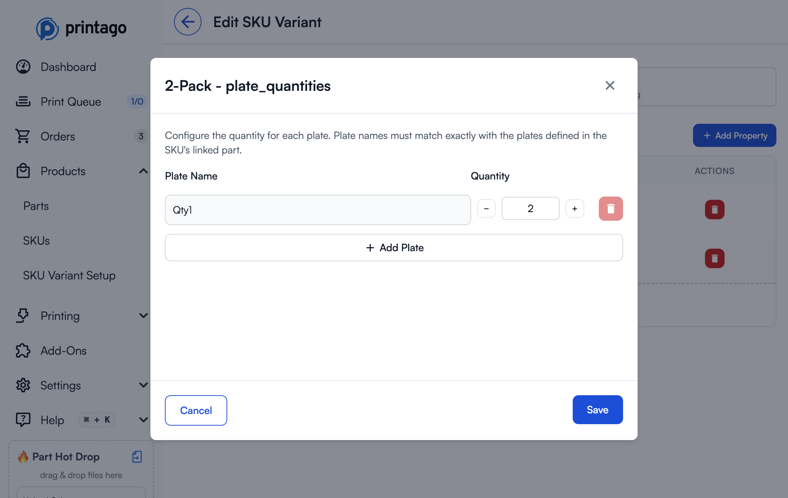

# SKU Variants

SKU Variants are one of Printago's most powerful features, enabling complex product variations and customization without SKU proliferation in your e-commerce stores. With Variants, a single product listing can handle dozens of color combinations, sizes, and personalizations automatically.


## Overview

SKU Variants solve a critical problem for 3D printing businesses: managing product variations. Instead of creating separate SKUs for every color/size/material combination in your store, Variants let you:

- Create reusable variation definitions that work across multiple SKUs
- Map e-commerce options directly to materials, colors, and parameters
- Automate complex multi-color designs based on customer selections
- Handle custom sizing through OpenSCAD parameters
- Process personalized orders with customer text input

:::tip Real-World Impact
A phone case with 5 colors and 3 sizes would normally require 15 separate SKUs in your store. With Printago Variants, you need just one SKU listing that automatically handles all 15 combinations.
:::

## Core Concepts

### Variants
A **Variant** represents a customer-facing option in your e-commerce store. Examples include:
- "Color"
- "Size"
- "Theme"
- "Finish Type"
- "Inlay Design"

:::important Naming Convention
Variant names in Printago must **exactly match** the option names in your e-commerce platform (Shopify, Etsy, etc.) for automatic order processing to work correctly.
:::

### Variant Values
**Variant Values** are the specific options customers can choose for each Variant. For a "Color" variant, values might include:
- "Black"
- "Red"
- "Jet Black"
- "Carbon"

Like Variant names, these values must exactly match how they appear in your e-commerce listings.

### Properties
**Properties** are where the magic happens - they're the internal mappings that tell Printago what each Variant Value actually means for production. There are three types:

#### Material Properties
Map variant values to specific materials and colors in your Printago library. Examples:
- "PLA Colors"
- "TPU Colors"
- "Phone Case Colors"
- "Primary Color"
- "Secondary Color"

#### Text Properties
Pass values to OpenSCAD parameters for dynamic sizing and modifications. Examples:
- "size_in_cm"
- "width_inches"
- "handle_length"
- "font_scale"

#### Plate Quantities Properties
Control how many of each plate to print based on the variant selection. Useful for multi-pack products or selectively printing specific plates from a multi-plate 3MF. Examples:
- "plate_quantities" - For pack size variants (1-pack, 5-pack, 10-pack)
- Allows printing a 10-pack as optimized plate arrangements (e.g., 2 plates of 4 + 2 plates of 2 instead of 10 plates of 1)

:::tip Property Flexibility
A single Variant can have multiple Properties. For example, your "Color" variant might have both "PLA Colors" and "PETG Colors" properties, allowing the same variant to work across different material-based SKUs.
:::

### Personalization
**Personalization** is a special variant type used for customer freeform text input (like custom engravings). The Personalization variant:
- Is created by clicking "Enable Personalization" on the SKU Variants page
- Has no Variant Values (customers enter free text instead)
- Automatically includes a "Value" property that captures the customer's text input
- Can be mapped to OpenSCAD parameters to use the custom text in your designs
- Is used for Etsy's Personalization field and custom text inputs

You can only have one Personalization variant per store. Once enabled, the "Enable Personalization" button will no longer appear.

## How It Works: The Complete Flow

### Step 1: Create a Variant

1. Navigate to `Products → SKU Variant Setup`
2. Click `New Variant` for standard options like colors, sizes, etc.
3. Enter the variant name exactly as it appears in your e-commerce platform
4. Click `Create Variant`

**For Personalization**: Click `Enable Personalization` to automatically create a "Personalization" variant with a "Value" property for customer text input. This button will only appear if personalization hasn't been enabled yet.


### Step 2: Add Properties

Properties define what each variant value will map to in production.

1. Click on a variant in the table to edit it
2. Click `Add Property` button
3. Enter a property name (e.g., "PLA Colors", "Primary Color", "size_cm", "plate_quantities")
4. Select property type:
   - **Material/Color** - For mapping to materials in your library
   - **Text** - For passing values to OpenSCAD parameters
   - **Plate Quantities** - For driving different plate quantities per variant (e.g., multi-packs)
5. Click `Add Property` to save


:::tip Property Naming Strategy
Use descriptive property names that indicate their purpose. "PLA Colors" is clearer than "Color1" when you're managing multiple material types.
:::

### Step 3: Add Variant Values and Map Properties

1. In the variant editing page, enter a variant value name in the text field at the bottom of the table
2. Click `Add` to create the variant value
3. For each Property, map the appropriate value:
   - **Material Properties**: Select from your Material library
   - **Text Properties**: Enter the text/number value to pass to OpenSCAD


### Step 4: Assign Variants to SKUs

1. Open your SKU for editing (`Products → SKUs`, then click on a SKU)
2. Scroll down to the **SKU Variant Setup** section and click `Add Variants`
3. In the "Select SKU Variants" dialog, check the variants you want to apply to this SKU
4. Click `Add Selected Options`


Once you've added variants to your SKU, they'll appear in the **SKU Variant Setup** section:


Now you need to map the variant properties to your parts:

#### Mapping Properties to Material Slots

For parts with materials (STL, 3MF, etc.):
1. In the **Linked Parts** section, click `Edit` on the part
2. In the **Materials** section, you'll see each material slot from your part
3. For each material slot, click `Configure`
4. In the **Material Mappings** section (at the bottom), click the button for the property you want to use (e.g., "Primary color → material")
5. Click `Save` to apply the mapping


6. Once saved, materials mapped to properties will show "Overridden" status with the property name


:::tip Dynamic Material Mapping
When a material slot is mapped to a variant property, it will use the material specified in the selected variant value. This allows one part file to handle multiple material/color combinations automatically.
:::

#### Mapping Properties to OpenSCAD Parameters

For OpenSCAD parts with parameters:
1. Click `Edit` on the OpenSCAD part
2. In the Parameters section, you'll see all parsed parameters
3. Click the link icon next to a parameter to connect it to a Text Property
4. Select which Variant and which Text Property to use
5. Linked parameters show the mapping (e.g., "Size → scad_size")


:::tip Parameter Linking
Text Properties can pass both text strings and numeric values to OpenSCAD. Make sure the property value type matches what your OpenSCAD code expects.
:::

#### Mapping Plate Quantities to Parts

For multi-plate 3MF parts where you want to control quantities per variant:

1. In the **Linked Parts** section, click `Edit` on the part
2. In the **Plates** section, click the link icon (next to "Editing each")
3. Select the Plate Quantities property you want to use (e.g., "Pack Size → plate_quantities")
4. Click `Save Linked Part`


Once linked, the plate quantities will automatically adjust based on the selected variant value.

**Configuring Plate Quantities for Each Variant Value**:

1. Navigate to `Products → SKU Variant Setup`
2. Click on your variant to edit it
3. For each variant value, click `Edit Plate Quantities`
4. In the configuration dialog, set the quantity for each plate:
   - Enter the plate name (must match the plate name in your 3MF file)
   - Set the quantity (how many times to print this plate)
5. Click `Save`




:::note Unused Plate Warning
If a plate never appears in any variant value configuration (quantity is always 0), Printago will show a warning badge on that plate. This helps you identify plates that may have been accidentally excluded from all variant values.


:::

:::tip Optimized Multi-Pack Production
Plate Quantities let you optimize production for multi-pack products. Instead of printing 10 individual plates for a 10-pack, you can print 1 plate with 8 items and 2 plates with 1 item each, dramatically reducing print time and material waste.
:::

## Printing SKUs with Variants

When you click the **Print** button on a SKU, Printago automatically determines which view to show based on whether variants are configured:

### Options View (Default for SKUs with Variants)

If your SKU has variants configured, Printago shows the **Options View** - a simplified interface that lets you select from your pre-configured variant options:


In Options View, you:
- Select variant values from dropdowns (e.g., "Color Theme", "Font")
- Enter personalization text if configured
- Choose printer and priority settings
- Set quantity

Printago automatically maps your selections to the correct materials, parameters, and plate quantities based on your variant configuration.

### Full View (Manual Control)

Click **Full View →** to switch to complete manual control over all aspects of the print:


In Full View, you can:
- Manually edit all OpenSCAD parameters
- Override material selections for each material slot
- Adjust plate quantities individually
- Make one-off customizations without changing variant configuration

:::tip Toggling Between Views
You can freely switch between Options View and Full View during print setup. Options View is faster for standard orders, while Full View gives you complete control when you need it.
:::

:::note No Variants = Full View Only
If a SKU has no variants configured, clicking Print goes directly to Full View, since there are no pre-configured options to select from.
:::

## Real-World Examples

### Example 1: Simple Color Variation

**Scenario**: Phone cases in 5 colors (Black, Red, Blue, Green, White) made from PLA

**Setup**:
1. Create Variant: "Color"
2. Add Property: "PLA Colors" (Material type)
3. Add Variant Values and map to materials:
   - Black → "Bambu Basic PLA Black"
   - Red → "Bambu Basic PLA Red"
   - Blue → "Polymaker PLA Blue"
   - Green → "Bambu Basic PLA Green"
   - White → "Bambu Basic PLA White"
4. Assign to SKU and map "PLA Colors" property to the phone case part

**Result**: One e-commerce listing automatically handles all 5 colors.

### Example 2: Multi-Material Support

**Scenario**: Same phone case, but you offer it in both PLA and TPU

**Setup**:
1. Use the same "Color" Variant from Example 1
2. Add second Property: "TPU Colors" (Material type)
3. For each Variant Value, map both properties:
   - Black → PLA: "Bambu Basic PLA Black", TPU: "SunLu TPU Black"
   - Red → PLA: "Bambu Basic PLA Red", TPU: "SunLu TPU Red"
   - (etc.)
4. Create two SKUs:
   - Phone Case PLA: Maps "PLA Colors" property
   - Phone Case TPU: Maps "TPU Colors" property

**Result**: Same Variant powers two different SKUs with different materials.

### Example 3: Complex Multi-Color Design

**Scenario**: Toy figure with "Theme" options where each theme has different Primary and Secondary colors

**Setup**:
1. Create Variant: "Theme"
2. Add Properties: "Primary Color", "Secondary Color" (both Material type)
3. Add Variant Values:
   - "Hero" → Primary: "Bambu Basic PLA Red", Secondary: "Bambu Basic PLA Cobalt Blue"
   - "Sidekick" → Primary: "Bambu Basic PLA Green", Secondary: "Bambu Basic PLA Jade White"
   - "Villain" → Primary: "Bambu Matte PLA Black", Secondary: "Bambu Basic PLA Purple"
4. In your multi-color 3MF SKU:
   - Map Color Slot 1 to "Primary Color" property
   - Map Color Slot 2 to "Secondary Color" property

**Result**: One e-commerce listing, multiple complex color combinations handled automatically.

### Example 4: E-Commerce Display Name Mapping

**Scenario**: Your store shows customer-friendly names that differ from your internal material names

**Setup**:
1. Create Variant: "Color"
2. Add Property: "Actual Colors" (Material type)
3. Map display names to materials:
   - "Jet Black" → "Bambu Basic PLA Black"
   - "Carbon" → "Bambu Matte PLA Black"
   - "Snow White" → "Bambu Basic PLA White"
   - "Pearl White" → "Bambu Matte PLA White"
4. Assign to SKU and map "Actual Colors" property to your part's material slot

**Result**: Customers see fancy names, but Printago automatically uses the correct materials.

### Example 5: Dynamic Sizing with OpenSCAD

**Scenario**: Customizable storage box in Small, Medium, Large

**Setup**:
1. Create Variant: "Size"
2. Add three Text Properties to the variant (one at a time): "width_cm", "depth_cm", "height_cm"
3. Add Variant Values:
   - "Small" → width_cm: "10", depth_cm: "8", height_cm: "6"
   - "Medium" → width_cm: "15", depth_cm: "12", height_cm: "9"
   - "Large" → width_cm: "20", depth_cm: "16", height_cm: "12"
4. In your OpenSCAD part, reference these parameters:
```openscad
width = width_cm;   // Will receive "10", "15", or "20"
depth = depth_cm;   // Will receive "8", "12", or "16"
height = height_cm; // Will receive "6", "9", or "12"

cube([width, depth, height]);
```
5. In SKU configuration, link OpenSCAD parameters to Text Properties:
   - `width_cm` parameter → "Size" variant → "width_cm" property
   - `depth_cm` parameter → "Size" variant → "depth_cm" property
   - `height_cm` parameter → "Size" variant → "height_cm" property

**Result**: One OpenSCAD part automatically generates three different sizes.

### Example 6: Personalized Text with Sizing

**Scenario**: Custom number cutter cookie cutters where customers choose a size and enter a number

**Setup**:
1. Create Variant: "Size" with Text Property "scad_size"
   - "Small" → scad_size: "2"
   - "Medium" → scad_size: "3"
   - "Large" → scad_size: "4"
2. Enable Personalization by clicking "Enable Personalization" (creates a "Personalization" variant automatically)
3. In OpenSCAD part:
```openscad
size_multiplier = scad_size; // Gets "2", "3", or "4"
custom_number = Value;       // Gets customer's text input

// Use these values to create the cutter
```
4. In SKU configuration:
   - Link `size_multiplier` parameter to "Size" → "scad_size"
   - Link `custom_number` parameter to "Personalization" → "Value"

**Result**: Customers select size and enter their number, Printago generates the perfect cookie cutter automatically.

### Example 7: Multi-Pack with Optimized Plate Quantities

**Scenario**: Selling "Love You" signs in 2-Pack and 10-Pack sizes, with pre-scaled plates for efficient production

**Setup**:
1. Create Variant: "Pack Size"
2. Add Property: "plate_quantities" (Plate Quantities type)
3. Create a 3MF with multiple plates:
   - "Qty1" plate: Contains 1 sign
   - "Qty8" plate: Contains 8 signs arranged efficiently
4. Add Variant Values and configure plate quantities:
   - "2-Pack" → Qty1: 2 plates, Qty8: 0 plates
   - "10-Pack" → Qty1: 2 plates, Qty8: 1 plate
5. Assign to SKU and map "plate_quantities" property to the part's plates

**Result**:
- 2-Pack orders print 2 individual plates (2 signs total)
- 10-Pack orders print 1 plate of 8 + 2 individual plates (10 signs total)
- Optimized production reduces print time by 60% for 10-packs compared to printing 10 individual plates

:::tip Advanced Use Cases
Plate Quantities can also handle auxiliary parts with different properties, or selectively print specific plates based on customer selections for size-variant products.
:::

## E-Commerce Integration

### Name Matching

For automatic order processing, variant and value names must exactly match your e-commerce platform:

**Shopify Example**:
- If your product has a "Colour" option (British spelling), your Printago Variant must be named "Colour"
- If a value is "Matte Black", it must be "Matte Black" in Printago (not "matte black" or "MatteBlack")

**Etsy Example**:
- Etsy's dropdown values must match your Printago Variant Values
- Etsy's Personalization field maps to the "Personalization" variant automatically (you must enable Personalization first)

### Order Processing Flow


### Handling New Options

When you add a new color or size to your e-commerce listing:

1. Order arrives in Printago Orders queue
2. Printago detects unmapped Variant Value
3. Order is flagged for review with clear indication of what's missing
4. Navigate to SKU Variants page
5. Add the new Variant Value with appropriate Property mappings
6. Return to Orders queue and reprocess the order

:::tip Proactive Management
When adding new options to your store, add them to Printago first to avoid order processing delays.
:::

## SKU Suffixes

SKU Suffixes enable automatic parsing and resolution of variant SKUs based on suffix patterns. This allows a SKU like `TSHIRT-RD-M` to automatically match the base SKU `TSHIRT` with Color=Red and Size=Medium variants.

### When to Use

Enable SKU Suffixes when your e-commerce platform or workflow requires unique SKU codes for each variant combination:

- **Amazon** - Requires unique SKUs per variant for inventory tracking
- **Multi-channel selling** - Some platforms need distinct SKU codes for each variation
- **Inventory systems** - External systems that track variants by full SKU strings

:::info Shopify and Etsy
Most Shopify and Etsy sellers don't need SKU Suffixes - these platforms handle variant matching through their option systems.
:::

### How It Works

#### Basic Concept

When you enable SKU Suffixes on a variant:

1. **Base SKU**: Your product's base SKU string (e.g., `TSHIRT`)
2. **Suffix Values**: Each variant value gets one or more suffix strings (e.g., `-RD`, `-RED`)
3. **Variant Order**: Variants are parsed in the order they're bound to the SKU
4. **Full SKU**: Combines base + suffixes (e.g., `TSHIRT-RD-M` = Red, Medium)


#### Parsing Rules

**Order Enforcement**: Variants must appear in the exact order they're bound to the SKU:
- ✅ `TSHIRT-RD-M` (Color first, then Size) - Valid
- ❌ `TSHIRT-M-RD` (Size first, then Color) - Invalid

**Greedy Matching**: For each variant position, Printago tries to match the longest possible suffix first.

**Personalization Exclusion**: The Personalization variant is excluded from suffix matching - customer text input comes from personalization fields, not SKU suffixes.

#### Example Configuration

```
Base SKU: TSHIRT

Variant 1 (first position): Color
  - Red: "-RD", "-RED"
  - Blue: "-BL", "-BLUE"
  - Black: "-BK", "-BLACK"

Variant 2 (second position): Size
  - Small: "-S", "-SMALL"
  - Medium: "-M", "-MEDIUM"
  - Large: "-L", "-LARGE"

Valid SKUs:
  - TSHIRT-RD-M → Red, Medium
  - TSHIRT-RED-SMALL → Red, Small
  - TSHIRT-BL-L → Blue, Large
```

### Configuring SKU Suffixes

1. Navigate to `Products → SKU Variant Setup`
2. Click on your variant to edit it
3. Check **Enable SKU Suffixes**
4. For each variant value, enter one or more suffix strings in the SKU Suffix column
5. Suffixes can be entered as tags - press Enter or comma to add multiple options

**Multiple Suffixes**: You can provide multiple suffix options for each value (like `-RD` and `-RED`). Printago will match whichever suffix appears in the incoming SKU.

### Testing Your Configuration

Use the **Check SKU Suffix** button on the SKU edit page to test suffix matching:

1. Open your SKU for editing
2. Click **Check SKU Suffix**
3. Enter a suffix combination (e.g., `-RW-BARB`)
4. Click **Check**

**Success** - Shows the parsed base SKU and matched variant values:


**Error** - Shows which SKU string failed to match:


### Validation

Printago rejects SKU suffix matches when:

- Base SKU doesn't match any configured SKU
- Not all required variants are matched
- Extra unparseable characters remain after parsing
- Suffixes appear in wrong order
- An invalid/unknown suffix is provided

When a match fails, orders are flagged for manual review with details about what couldn't be matched.

## ColorSCAD Integration

For SKUs using [ColorSCAD](/docs/products/openscad/colorscad.md) parts, Variants can map to programmatic colors:

1. Your OpenSCAD file defines colors: `color("primary") make_part1();`
2. Printago detects the "primary" color identifier
3. In SKU Variant mapping, assign a Material Property to "primary"
4. Customer selects variant value (e.g., "Hero")
5. Printago automatically uses the mapped Primary Color material

This enables complex multi-color OpenSCAD designs with customer-selectable color schemes!

## Best Practices

### Planning Your Variants

**Start with a superset approach**: If you have multiple SKUs that use similar options, create Variants with all possible values:
```
"Color" Variant might need:
- PLA Colors property (for PLA SKUs)
- TPU Colors property (for TPU SKUs)
- PETG Colors property (for PETG SKUs)
- Primary Color property (for multi-color SKUs)
- Secondary Color property (for multi-color SKUs)
```

Each SKU only uses the Properties it needs, but you maintain one unified Variant.

### Naming Conventions

**Variant Names**: Match your e-commerce platform exactly
- ✅ "Color" (if that's what your store shows)
- ❌ "color" (wrong capitalization)
- ❌ "Colour" (if your store says "Color")

**Property Names**: Use descriptive internal names
- ✅ "PLA Colors", "Primary Color", "size_in_cm"
- ❌ "prop1", "c1", "p"

**Variant Values**: Match store exactly, but also consider:
- Future-proofing: Will this name still make sense in 6 months?
- Clarity: Is "Black" clear, or do you need "Matte Black" vs "Glossy Black"?

### Testing Your Setup

Before launching with e-commerce automation:

1. Create a test order manually in Printago
2. Select each variant combination
3. Verify materials are assigned correctly
4. Check that OpenSCAD parameters produce expected results
5. Print a physical sample of each major variation

### Performance Tips

- **Reuse Variants**: Create general-purpose Variants (like "Color") that can be used across many SKUs
- **Property organization**: Group similar Property types together for easier management
- **Documentation**: Keep notes on which Properties are used by which SKUs
- **Regular audits**: Periodically review unused Variant Values and Properties

## Troubleshooting

### Orders Stuck in Review

**Problem**: Orders aren't automatically processing

**Solutions**:
1. Check variant name spelling matches e-commerce exactly (including capitalization)
2. Verify all Variant Values are mapped to Properties
3. Ensure Properties are assigned to parts in the SKU
4. Check that mapped materials exist in your Material library

### Wrong Materials Assigned

**Problem**: Parts are printing with incorrect materials

**Solutions**:
1. Review Property mappings in Variant Values
2. Verify correct Properties are mapped to parts in SKU
3. Check for conflicting Property assignments
4. Ensure Material library items haven't been renamed/deleted

### OpenSCAD Parameters Not Working

**Problem**: Text properties aren't affecting OpenSCAD output

**Solutions**:
1. Verify OpenSCAD parameter names match Property names exactly
2. Check that Text Properties contain valid values (numbers for numeric parameters)
3. Ensure parameters are linked correctly (check for link icon in configuration)
4. Test the OpenSCAD file locally with the expected parameter values

### Missing Color Slots in 3MF

**Problem**: Can't find all colors to map Properties to

**Solutions**:
1. Verify 3MF was created with color painting enabled
2. Check that all desired colors are actually used in the 3MF file
3. Re-export the 3MF from your slicer if colors are missing
4. Static colors don't need Property mapping - only dynamic ones

## Getting Help

SKU Variants are powerful but can be complex to set up initially. We're here to help!

### Support Resources
- **Documentation**: You're reading it! Re-read sections for specific scenarios
- **Discord Community**: Ask questions in #variants channel - [Join Discord](https://discord.gg/RCFA2u99De)
- **Video Tutorial**: Watch our step-by-step setup guide [Link to video]
- **Support Email**: support@printago.io for complex scenarios

### 1:1 Setup Assistance

Need hands-on help? We offer **free 1:1 video calls** with Printago founders to help you set up SKU Variants correctly for your specific products.

**What we'll help with**:
- Planning your Variant structure
- Mapping complex multi-color designs
- E-commerce integration setup
- OpenSCAD parameter configuration
- Troubleshooting existing setups

**Book your session**: Click the "Schedule 1:1 Setup Call" button on the SKU Variants page, or [book directly here](https://calendar.link/printago).

:::tip Success Stories
Many of our most successful users started with a 1:1 setup call. Don't hesitate to reach out - we love helping businesses automate their workflows!
:::

## Related Topics

- **[SKU Management](/docs/commerce/sku-management.md)** - Creating and organizing SKUs
- **[Orders](/docs/commerce/orders.md)** - Processing e-commerce orders automatically
- **[OpenSCAD Parts](/docs/products/openscad/openscad-parts.md)** - Creating parametric designs
- **[ColorSCAD](/docs/products/openscad/colorscad.md)** - Multi-color OpenSCAD support
- **[Materials](/docs/printing/materials.md)** - Managing your material library
- **[Shopify Integration](/docs/integrations/shopify.md)** - Connecting your Shopify store
- **[Etsy Integration](/docs/integrations/etsy.md)** - Connecting your Etsy shop

---

Need help with SKU Variants? Join our [Discord community](https://discord.gg/RCFA2u99De) or email support@printago.io!
