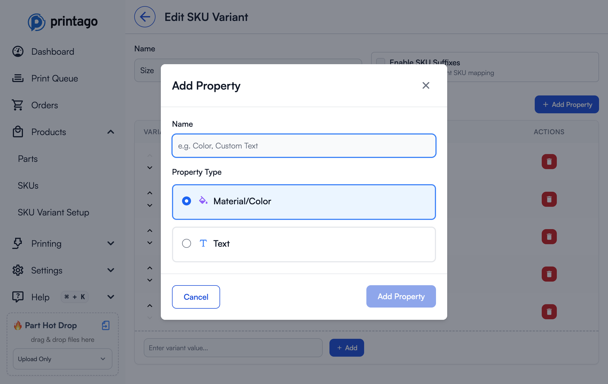
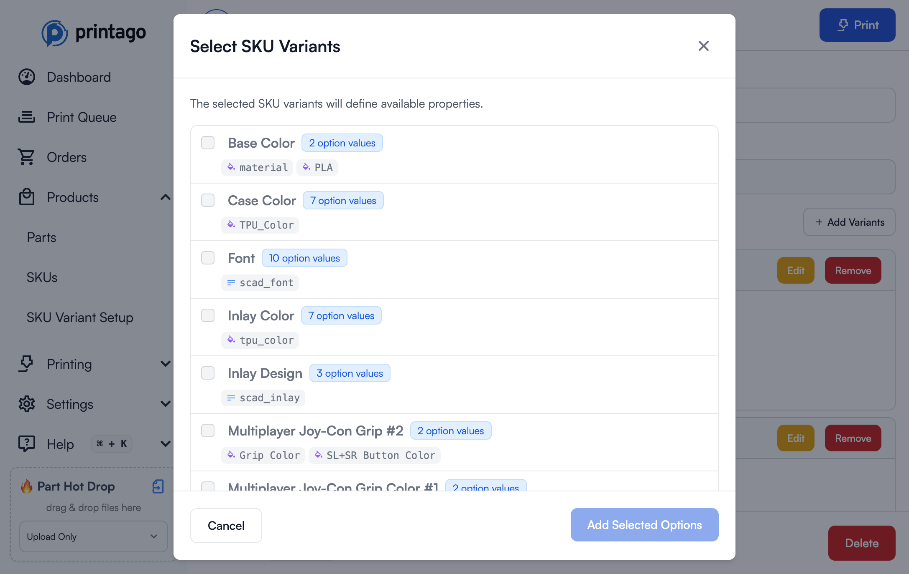

# SKU Variants 💎

SKU Variants are one of Printago's most powerful features, enabling complex product variations and customization without SKU proliferation in your e-commerce stores. With Variants, a single product listing can handle dozens of color combinations, sizes, and personalizations automatically.


## Overview

SKU Variants solve a critical problem for 3D printing businesses: managing product variations. Instead of creating separate SKUs for every color/size/material combination in your store, Variants let you:

- Create reusable variation definitions that work across multiple SKUs
- Map e-commerce options directly to materials, colors, and parameters
- Automate complex multi-color designs based on customer selections
- Handle custom sizing through OpenSCAD parameters
- Process personalized orders with customer text input

:::tip Real-World Impact
A phone case with 5 colors and 3 sizes would normally require 15 separate SKUs in your store. With Printago Variants, you need just one SKU listing that automatically handles all 15 combinations.
:::

## Core Concepts

### Variants
A **Variant** represents a customer-facing option in your e-commerce store. Examples include:
- "Color"
- "Size"
- "Theme"
- "Finish Type"
- "Inlay Design"

:::important Naming Convention
Variant names in Printago must **exactly match** the option names in your e-commerce platform (Shopify, Etsy, etc.) for automatic order processing to work correctly.
:::

### Variant Values
**Variant Values** are the specific options customers can choose for each Variant. For a "Color" variant, values might include:
- "Black"
- "Red"
- "Jet Black"
- "Carbon"

Like Variant names, these values must exactly match how they appear in your e-commerce listings.

### Properties
**Properties** are where the magic happens - they're the internal mappings that tell Printago what each Variant Value actually means for production. There are two types:

#### Material Properties
Map variant values to specific materials and colors in your Printago library. Examples:
- "PLA Colors"
- "TPU Colors"
- "Phone Case Colors"
- "Primary Color"
- "Secondary Color"

#### Text Properties
Pass values to OpenSCAD parameters for dynamic sizing and modifications. Examples:
- "size_in_cm"
- "width_inches"
- "handle_length"
- "font_scale"

:::tip Property Flexibility
A single Variant can have multiple Properties. For example, your "Color" variant might have both "PLA Colors" and "PETG Colors" properties, allowing the same variant to work across different material-based SKUs.
:::

### Personalization Variants
**Personalization Variants** are a special type used for customer freeform text input (like custom engravings). Unlike regular Variants:
- They have no Variant Values
- They have no Properties
- They capture raw customer text input
- Currently used exclusively for Etsy's Personalization field

## How It Works: The Complete Flow


### Step 1: Create a Variant

1. Navigate to `Products → SKU Variant Setup`
2. Click `New Variant` (for standard options like colors, sizes, etc.) or `New Personalization` (for customer text input)
3. Enter the variant name exactly as it appears in your e-commerce platform
4. Click `Create Variant` or `Create Personalization`

**Standard Variant Dialog:**


**Personalization Variant Dialog:**


### Step 2: Add Properties

Properties define what each variant value will map to in production.

1. Click on a variant in the table to edit it
2. Click `Add Property` button
3. Enter a property name (e.g., "PLA Colors", "Primary Color", "size_cm")
4. Select property type:
   - **Material/Color** - For mapping to materials in your library
   - **Text** - For passing values to OpenSCAD parameters
5. Click `Add Property` to save



:::tip Property Naming Strategy
Use descriptive property names that indicate their purpose. "PLA Colors" is clearer than "Color1" when you're managing multiple material types.
:::

### Step 3: Add Variant Values and Map Properties

1. In the variant editing page, enter a variant value name in the text field at the bottom of the table
2. Click `Add` to create the variant value
3. For each Property, map the appropriate value:
   - **Material Properties**: Select from your Material library
   - **Text Properties**: Enter the text/number value to pass to OpenSCAD


#### Advanced: Enable SKU Suffixes

When enabled, SKU Suffixes allow Printago to generate unique SKU identifiers for each variant combination, which some e-commerce platforms require for inventory tracking.

**Example**:
- Base SKU: `PHONE-CASE-001`
- With suffixes enabled:
  - Red variant becomes: `PHONE-CASE-001-RED`
  - Blue variant becomes: `PHONE-CASE-001-BLUE`

To enable SKU Suffixes:
1. Edit your Variant
2. Check "Enable SKU Suffixes"
3. Printago will automatically append variant values to your base SKU

:::info When to Use SKU Suffixes
Enable this when your e-commerce platform requires unique SKU codes per variant. Shopify and some others work fine without suffixes, while platforms like Amazon may require them for inventory tracking.
:::

### Step 4: Assign Variants to SKUs

1. Open your SKU for editing (`Products → SKUs`, then click on a SKU)
2. Scroll down to the **SKU Variant Setup** section and click `Add Variants`
3. In the "Select SKU Variants" dialog, check the variants you want to apply to this SKU
4. Click `Add Selected Options`



Once you've added variants to your SKU, they'll appear in the **SKU Variant Setup** section:


Now you need to map the variant properties to your parts:

#### Mapping Properties to STL Parts

For single-material STL parts:
1. In the **Linked Parts** section, click `Edit` on the part
2. In the **Materials** section, click `Configure` next to the material
3. In the **Material Mappings** section (at the bottom), click the button for the property you want to use (e.g., "Base Color → material")
4. Click `Save` to apply the mapping
5. The material will now be resolved based on the customer's variant selection

#### Mapping Properties to OpenSCAD Parameters

For OpenSCAD parts with parameters:
1. Click `Edit` on the OpenSCAD part
2. In the Parameters section, you'll see all parsed parameters
3. Click the link icon next to a parameter to connect it to a Text Property
4. Select which Variant and which Text Property to use
5. Linked parameters show the mapping (e.g., "Size → scad_size")


:::tip Parameter Linking
Text Properties can pass both text strings and numeric values to OpenSCAD. Make sure the property value type matches what your OpenSCAD code expects.
:::

#### Mapping Properties to 3MF Multi-Color Models

For multi-color 3MF projects:
1. In the **Linked Parts** section, click `Edit` on the 3MF part
2. In the **Materials** section, you'll see each color slot from your 3MF
3. For each color slot, click `Configure`
4. In the **Material Mappings** section (at the bottom), click the button for the property you want to use (e.g., "Primary color → material")
5. Click `Save` to apply the mapping


6. Once saved, colors mapped to properties will show "Overridden" status with the property name


:::tip Dynamic Color Mapping
When a color slot is mapped to a variant property, it will use the material specified in the selected variant value. This allows one 3MF file to handle multiple color combinations automatically.
:::

## Real-World Examples

### Example 1: Simple Color Variation

**Scenario**: Phone cases in 5 colors (Black, Red, Blue, Green, White) made from PLA

**Setup**:
1. Create Variant: "Color"
2. Add Property: "PLA Colors" (Material type)
3. Add Variant Values and map to materials:
   - Black → "Bambu Basic PLA Black"
   - Red → "Bambu Basic PLA Red"
   - Blue → "Polymaker PLA Blue"
   - Green → "Bambu Basic PLA Green"
   - White → "Bambu Basic PLA White"
4. Assign to SKU and map "PLA Colors" property to the phone case part

**Result**: One e-commerce listing automatically handles all 5 colors.

### Example 2: Multi-Material Support

**Scenario**: Same phone case, but you offer it in both PLA and TPU

**Setup**:
1. Use the same "Color" Variant from Example 1
2. Add second Property: "TPU Colors" (Material type)
3. For each Variant Value, map both properties:
   - Black → PLA: "Bambu Basic PLA Black", TPU: "SunLu TPU Black"
   - Red → PLA: "Bambu Basic PLA Red", TPU: "SunLu TPU Red"
   - (etc.)
4. Create two SKUs:
   - Phone Case PLA: Maps "PLA Colors" property
   - Phone Case TPU: Maps "TPU Colors" property

**Result**: Same Variant powers two different SKUs with different materials.

### Example 3: Complex Multi-Color Design

**Scenario**: Toy figure with "Theme" options where each theme has different Primary and Secondary colors

**Setup**:
1. Create Variant: "Theme"
2. Add Properties: "Primary Color", "Secondary Color" (both Material type)
3. Add Variant Values:
   - "Hero" → Primary: "Bambu Basic PLA Red", Secondary: "Bambu Basic PLA Cobalt Blue"
   - "Sidekick" → Primary: "Bambu Basic PLA Green", Secondary: "Bambu Basic PLA Jade White"
   - "Villain" → Primary: "Bambu Matte PLA Black", Secondary: "Bambu Basic PLA Purple"
4. In your multi-color 3MF SKU:
   - Map Color Slot 1 to "Primary Color" property
   - Map Color Slot 2 to "Secondary Color" property

**Result**: One e-commerce listing, multiple complex color combinations handled automatically.

### Example 4: E-Commerce Display Name Mapping

**Scenario**: Your store shows customer-friendly names that differ from your internal material names

**Setup**:
1. Create Variant: "Color"
2. Add Property: "Actual Colors" (Material type)
3. Map display names to materials:
   - "Jet Black" → "Bambu Basic PLA Black"
   - "Carbon" → "Bambu Matte PLA Black"
   - "Snow White" → "Bambu Basic PLA White"
   - "Pearl White" → "Bambu Matte PLA White"

**Result**: Customers see fancy names, but Printago automatically uses the correct materials.

### Example 5: Dynamic Sizing with OpenSCAD

**Scenario**: Customizable storage box in Small, Medium, Large

**Setup**:
1. Create Variant: "Size"
2. Add Text Properties: "width_cm", "depth_cm", "height_cm"
3. Add Variant Values:
   - "Small" → width_cm: "10", depth_cm: "8", height_cm: "6"
   - "Medium" → width_cm: "15", depth_cm: "12", height_cm: "9"
   - "Large" → width_cm: "20", depth_cm: "16", height_cm: "12"
4. In your OpenSCAD part, reference these parameters:
```openscad
width = width_cm;   // Will receive "10", "15", or "20"
depth = depth_cm;   // Will receive "8", "12", or "16"
height = height_cm; // Will receive "6", "9", or "12"

cube([width, depth, height]);
```
5. In SKU configuration, link OpenSCAD parameters to Text Properties:
   - `width_cm` parameter → "Size" variant → "width_cm" property
   - `depth_cm` parameter → "Size" variant → "depth_cm" property
   - `height_cm` parameter → "Size" variant → "height_cm" property

**Result**: One OpenSCAD part automatically generates three different sizes.

### Example 6: Combined Variations

**Scenario**: Phone case with Color (5 options), Material (PLA/TPU), and Size (3 phone models)

**Setup**:
1. Create three Variants: "Color", "Material Type", "Phone Model"
2. "Color" variant: 5 values with PLA and TPU properties
3. "Material Type" variant: 2 values (PLA, TPU)
4. "Phone Model" variant: 3 values with OpenSCAD dimension parameters
5. Create one master SKU that uses all three variants

**Result**: Single e-commerce listing handles 5 × 2 × 3 = 30 combinations automatically.

### Example 7: Personalized Text with Sizing

**Scenario**: Custom number cutter cookie cutters where customers choose a size and enter a number

**Setup**:
1. Create Variant: "Size" with Text Property "scad_size"
   - "Small" → scad_size: "2"
   - "Medium" → scad_size: "3"
   - "Large" → scad_size: "4"
2. Create Personalization Variant: "Personalization"
3. In OpenSCAD part:
```openscad
size_multiplier = scad_size; // Gets "2", "3", or "4"
custom_number = Value;       // Gets customer's text input

// Use these values to create the cutter
```
4. In SKU configuration:
   - Link `size_multiplier` parameter to "Size" → "scad_size"
   - Link `custom_number` parameter to "Personalization" → "Value"

**Result**: Customers select size and enter their number, Printago generates the perfect cookie cutter automatically.

## E-Commerce Integration

### Name Matching

For automatic order processing, variant and value names must exactly match your e-commerce platform:

**Shopify Example**:
- If your product has a "Colour" option (British spelling), your Printago Variant must be named "Colour"
- If a value is "Matte Black", it must be "Matte Black" in Printago (not "matte black" or "MatteBlack")

**Etsy Example**:
- Etsy's dropdown values must match your Printago Variant Values
- Etsy's Personalization field maps to Personalization Variants automatically

### Order Processing Flow


### Handling New Options

When you add a new color or size to your e-commerce listing:

1. Order arrives in Printago Orders queue
2. Printago detects unmapped Variant Value
3. Order is flagged for review with clear indication of what's missing
4. Navigate to SKU Variants page
5. Add the new Variant Value with appropriate Property mappings
6. Return to Orders queue and reprocess the order

:::tip Proactive Management
When adding new options to your store, add them to Printago first to avoid order processing delays.
:::

## ColorSCAD Integration

For SKUs using [ColorSCAD](/docs/products/openscad/colorscad.md) parts, Variants can map to programmatic colors:

1. Your OpenSCAD file defines colors: `color("primary") make_part1();`
2. Printago detects the "primary" color identifier
3. In SKU Variant mapping, assign a Material Property to "primary"
4. Customer selects variant value (e.g., "Hero")
5. Printago automatically uses the mapped Primary Color material

This enables complex multi-color OpenSCAD designs with customer-selectable color schemes!

## Best Practices

### Planning Your Variants

**Start with a superset approach**: If you have multiple SKUs that use similar options, create Variants with all possible values:
```
"Color" Variant might need:
- PLA Colors property (for PLA SKUs)
- TPU Colors property (for TPU SKUs)
- PETG Colors property (for PETG SKUs)
- Primary Color property (for multi-color SKUs)
- Secondary Color property (for multi-color SKUs)
```

Each SKU only uses the Properties it needs, but you maintain one unified Variant.

### Naming Conventions

**Variant Names**: Match your e-commerce platform exactly
- ✅ "Color" (if that's what your store shows)
- ❌ "color" (wrong capitalization)
- ❌ "Colour" (if your store says "Color")

**Property Names**: Use descriptive internal names
- ✅ "PLA Colors", "Primary Color", "size_in_cm"
- ❌ "prop1", "c1", "p"

**Variant Values**: Match store exactly, but also consider:
- Future-proofing: Will this name still make sense in 6 months?
- Clarity: Is "Black" clear, or do you need "Matte Black" vs "Glossy Black"?

### Testing Your Setup

Before launching with e-commerce automation:

1. Create a test order manually in Printago
2. Select each variant combination
3. Verify materials are assigned correctly
4. Check that OpenSCAD parameters produce expected results
5. Print a physical sample of each major variation

### Performance Tips

- **Reuse Variants**: Create general-purpose Variants (like "Color") that can be used across many SKUs
- **Property organization**: Group similar Property types together for easier management
- **Documentation**: Keep notes on which Properties are used by which SKUs
- **Regular audits**: Periodically review unused Variant Values and Properties

## Troubleshooting

### Orders Stuck in Review

**Problem**: Orders aren't automatically processing

**Solutions**:
1. Check variant name spelling matches e-commerce exactly (including capitalization)
2. Verify all Variant Values are mapped to Properties
3. Ensure Properties are assigned to parts in the SKU
4. Check that mapped materials exist in your Material library

### Wrong Materials Assigned

**Problem**: Parts are printing with incorrect materials

**Solutions**:
1. Review Property mappings in Variant Values
2. Verify correct Properties are mapped to parts in SKU
3. Check for conflicting Property assignments
4. Ensure Material library items haven't been renamed/deleted

### OpenSCAD Parameters Not Working

**Problem**: Text properties aren't affecting OpenSCAD output

**Solutions**:
1. Verify OpenSCAD parameter names match Property names exactly
2. Check that Text Properties contain valid values (numbers for numeric parameters)
3. Ensure parameters are linked correctly (check for link icon in configuration)
4. Test the OpenSCAD file locally with the expected parameter values

### Missing Color Slots in 3MF

**Problem**: Can't find all colors to map Properties to

**Solutions**:
1. Verify 3MF was created with color painting enabled
2. Check that all desired colors are actually used in the 3MF file
3. Re-export the 3MF from your slicer if colors are missing
4. Static colors don't need Property mapping - only dynamic ones

## Getting Help

SKU Variants are powerful but can be complex to set up initially. We're here to help!

### Support Resources
- **Documentation**: You're reading it! Re-read sections for specific scenarios
- **Discord Community**: Ask questions in #variants channel - [Join Discord](https://discord.gg/RCFA2u99De)
- **Video Tutorial**: Watch our step-by-step setup guide [Link to video]
- **Support Email**: support@printago.io for complex scenarios

### 1:1 Setup Assistance

Need hands-on help? We offer **free 1:1 video calls** with Printago founders to help you set up SKU Variants correctly for your specific products.

**What we'll help with**:
- Planning your Variant structure
- Mapping complex multi-color designs
- E-commerce integration setup
- OpenSCAD parameter configuration
- Troubleshooting existing setups

**Book your session**: Click the "Schedule 1:1 Setup Call" button on the SKU Variants page, or [book directly here](https://calendar.link/printago).

:::tip Success Stories
Many of our most successful users started with a 1:1 setup call. Don't hesitate to reach out - we love helping businesses automate their workflows!
:::

## Related Topics

- **[SKU Management](/docs/commerce/sku-management.md)** - Creating and organizing SKUs
- **[Orders](/docs/commerce/orders.md)** - Processing e-commerce orders automatically
- **[OpenSCAD Parts](/docs/products/openscad/openscad-parts.md)** - Creating parametric designs
- **[ColorSCAD](/docs/products/openscad/colorscad.md)** - Multi-color OpenSCAD support
- **[Materials](/docs/printing/materials.md)** - Managing your material library
- **[Shopify Integration](/docs/integrations/shopify.md)** - Connecting your Shopify store
- **[Etsy Integration](/docs/integrations/etsy.md)** - Connecting your Etsy shop

---

Need help with SKU Variants? Join our [Discord community](https://discord.gg/RCFA2u99De) or email support@printago.io!
