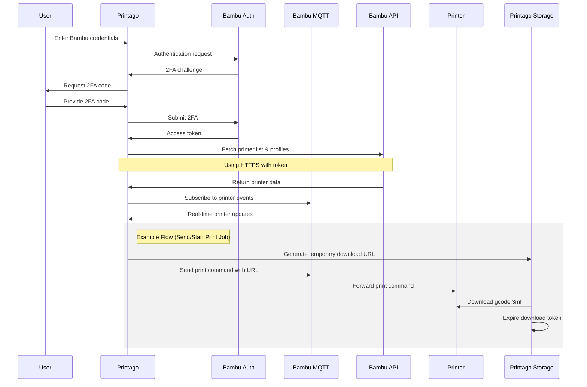

# Bambu Lab Integration

Printago offers seamless integration with Bambu Lab printers through Bambu's cloud infrastructure. This guide covers everything you need to know about connecting and managing your Bambu Lab printers with Printago.

## Connection Mode Support

Currently, Printago supports Bambu Lab printers operating in **Cloud Mode** only. Support for LAN Mode is under development and will be available in a future release.

:::caution Important Notice
Printago requires specific firmware versions that do not have the Bambu authorization lockout. See [Firmware Requirements](#firmware-requirements) for version details and downgrade instructions.

Our upcoming Fuse client will support newer firmware versions and models using Developer LAN mode, providing enhanced functionality and security.
:::

## First-Time Setup

For detailed instructions on connecting your Bambu Lab printers to Printago for the first time, please refer to our [Quick Start Guide](../getting-started/quick-start-guide.mdx). The guide covers:

- Prerequisites for printer connectivity
- Step-by-step connection process
- Initial printer configuration

:::tip Security
Your Bambu Lab account stays safe - we only store encrypted printer access tokens, never passwords. Want to learn more about our security? Chat with our development team on Discord or email support@printago.io.
:::

## Authentication Expiry

For security reasons, Printago does not store your Bambu Lab credentials. Instead, we only store encrypted printer access tokens that expire every 90 days.

**Re-authentication Required**: You'll need to re-authenticate your Bambu Lab account every 90 days to maintain printer connectivity.

14 days before your credentials expire, you'll see a red banner in the app reminding you to re-authenticate:

    

To re-authenticate, simply run the Bambu Integration Flow again through **Settings** → **Integrations** → **Bambu Lab** → `Configure`, and finally click the `Reauthenticate` button.  Or follow the link in the warning banner.

## Managing Connected Printers

The Bambu Integration Flow can be run at any time and may be accessed through either:
- **Settings** → **Integrations** → Click `Configure` on the Bambu Lab settings card
- **Printing** → **Printers** → Click the `Configure Bambu Printers` button in the upper right

The flow guides you through connecting your Bambu Lab account, syncing cloud profiles, and configuring printer settings.  

    

:::info
The Bambu Integration flow is currently the only mechanism to refresh your cloud-synced slicing profiles
:::

### Disabling Printers

1. Run the Bambu Integration Flow
2. Uncheck the boxes next to printers you want to disconnect
3. Complete the flow - Printago will stop all communication with unchecked printers.
4. To reconnect a printer later, run the flow again and check its box

:::caution
Disconnecting a printer will stop any active monitoring and prevent new print jobs from being sent to the printer. Current print jobs will continue until completion.
:::

## How Printago Connects to Your Printers

Printago integrates with Bambu Lab's cloud infrastructure to manage your printers securely:

## Compatible Printers 

Printago is compatible with the following Bambu Lab 3D Printers & Configurations

- **A1 Mini**
- **A1 Mini w/ AMS Lite** 
- **A1**  
- **A1 w/ AMS Lite**:  
- **P1S**
- **P1S w/ AMS**
- **P1S w/ AMS Pro**
- **P1S w/ AMS HT**
- **X1C**
- **X1C w/ AMS**

**Coming Soon:** 
- H2D
- A1 & A1-Mini: Support for AMS 2 Pro
- A1 & A1-Mini: Support for AMS HT 
- X1C: Support for AMS 2 Pro/HT

## Firmware Requirements

Printago requires specific firmware versions that do not have the Bambu authorization lockout:

- **A1 Mini**: 1.04
- **A1**: 1.04  
- **P1S**: 1.08.01
- **X1C**: 1.08.02

### Downgrading Firmware

If your printer has newer firmware, you can downgrade using either:

**Option 1: Bambu Handy Mobile App (Recommended)**

The easiest method is using Bambu Lab's mobile app "Handy" to upgrade or downgrade to a specific firmware version:

    

**Option 2: SD Card Method**

For manual firmware installation via SD card, follow the official Bambu Lab guides:

- [X1 Series](https://wiki.bambulab.com/en/x1/manual/X1-firmware-update-from-SD-card)
- [P1 Series](https://wiki.bambulab.com/en/p1/manual/P1-firmware-update-from-SD-card)
- [A1](https://wiki.bambulab.com/en/a1/manual/a1-firmware-update-from-SD-card)
- [A1 Mini](https://wiki.bambulab.com/en/a1-mini/manual/a1-mini-firmware-update-from-SD-card)

## Troubleshooting

If you encounter connection issues:

1. Verify your printer's internet connection
2. Ensure Cloud Mode is enabled on your printer
3. Try disconnecting and reconnecting the printer in Printago

If problems persist, contact Printago on [Discord](https://discord.gg/RCFA2u99De) or support@printago.io