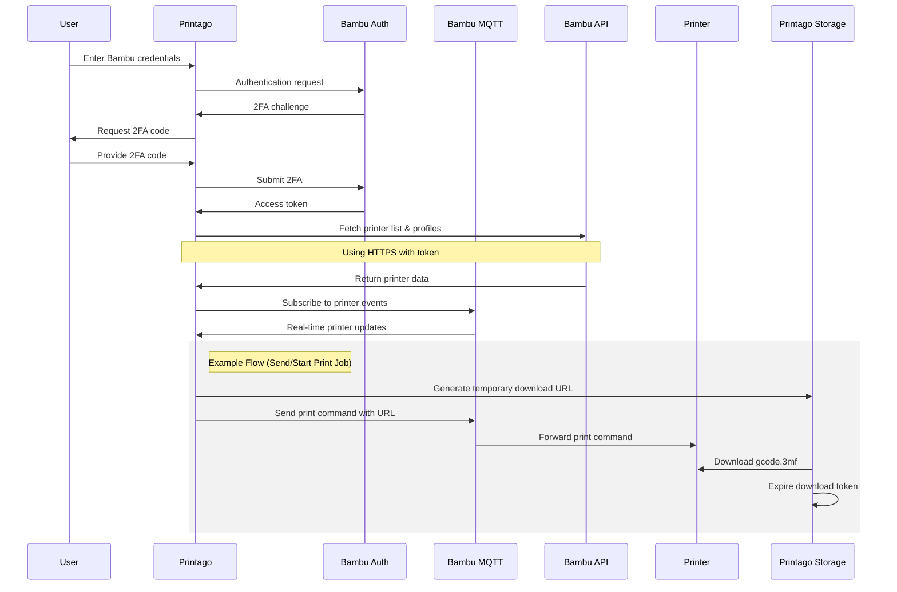

# Bambu Lab Integration

Printago offers seamless integration with Bambu Lab printers through Bambu's cloud infrastructure. This guide covers everything you need to know about connecting and managing your Bambu Lab printers with Printago.

## Connection Mode Support

Currently, Printago supports Bambu Lab printers operating in **Cloud Mode** only. Support for LAN Mode is under development and will be available in a future release.

:::caution Important Notice
Bambu Lab introduced major security changes in January 2025. We are actively working with them as they develop their Software Integrator partner program. For now, ***do not update to the Beta firmware if you have an X1 series printer***. Printago's connection methods may evolve as these changes roll out, but we are committed to maintaining seamless integration with your printers.
:::

## How Printago Connects to Your Printers

Printago integrates with Bambu Lab's cloud infrastructure to manage your printers securely:

## First-Time Setup

For detailed instructions on connecting your Bambu Lab printers to Printago for the first time, please refer to our [Quick Start Guide](../../getting-started/quick-setup.mdx). The guide covers:

- Prerequisites for printer connectivity
- Step-by-step connection process
- Initial printer configuration

:::tip Security
Your Bambu Lab account stays safe - we only store encrypted printer access tokens, never passwords. Want to learn more about our security? Chat with our development team on Discord or email support@printago.io.
:::

## Managing Connected Printers

The Bambu Integration Wizard can be run at any time and may be accessed through either:
- **Settings** → **Integrations** → Click `Configure` on the Bambu Lab card
- **Printing** → **Printers** → Click the `Configure Bambu Printers` button in the upper right

The wizard guides you through connecting your Bambu Lab account, syncing cloud profiles, and configuring printer settings.  

:::info
The wizard is currently the only mechanism to refresh your cloud-synced slicing profiles
:::

### Individual Printer Management

To configure a specific printer:
1. Navigate to **Printing** → **Printers**
2. Select your target printer
3. Click `Configure Profiles & Settings`
4. Adjust printer-specific settings:
    - Default print settings
    - Material profiles
    - Build Plate type
    - Bed Leveling for each print
    - Option to use AMS or External Spool 

:::warning AMS Printing
Multi-color is Coming Soon! Until then, printers with the `Use AMS` checkbox selected will feed from `Slot 1` (left-most) AMS slot.
:::

### Disconnecting Printers

1. Run the Bambu Integration Wizard
    - Via **Settings** → **Integrations** → `Configure`
    - Or **Printing** → **Printers** → Configuration button
2. Uncheck the boxes next to printers you want to disconnect
3. Complete the wizard - Printago will stop all communication with unchecked printers
4. To reconnect a printer later, run the wizard again and check its box

:::caution
Disconnecting a printer will stop any active monitoring and prevent new print jobs from being sent to the printer. Current print jobs will continue until completion.
:::

## Troubleshooting

If you encounter connection issues:

1. Verify your printer's internet connection
2. Ensure Cloud Mode is enabled on your printer
3. Try disconnecting and reconnecting the printer in Printago

If problems persist, contact Printago on [Discord](https://discord.gg/RCFA2u99De) or support@printago.io

## Future Updates

We're actively working on additional features including:

- LAN Mode support for local network operation
- Enhanced printer management capabilities
- Advanced material handling features

Stay tuned for updates and new features! Join our [Discord community](https://discord.gg/RCFA2u99De) for latest info and help!