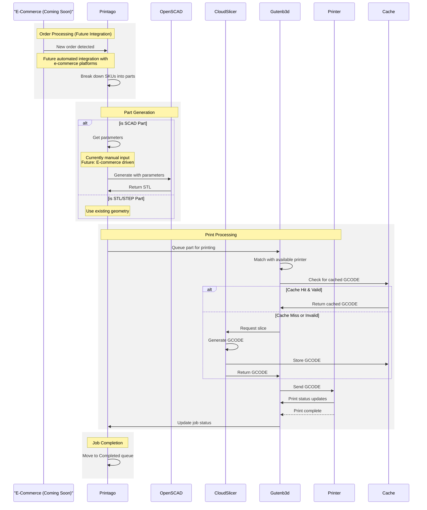

# Printing Files

Printago makes printing Parts and SKUs straightforward, whether you're printing a single part or a complex product with multiple components.

## Overview

You can print from either Parts or SKUs:
- Parts represent individual 3D models ready for printing
- SKUs are collections of parts that make up complete products
- Both support quantity settings and OpenSCAD parameters
- Both use the same printer assignment options

## Starting a Print

### From Parts
1. Navigate to `Products -> Parts`
2. Find your part and click the  button.
    
3. Set quantity and any OpenSCAD parameters
4. Choose printer assignment method

### From SKUs
1. Navigate to `Products -> SKUs`
2. Locate your SKU and click `Print`
3. Expand each part's section to:
   - Set quantities
   - Configure OpenSCAD parameters
   - Preview customizations

:::info OpenSCAD Parameters
Parts using OpenSCAD display parameter inputs based on how they're configured in the SKU. See [SKU Management](./file-management/sku-management.md) for details on parameter configuration.
:::

## Printer Assignment

When starting a print, you can target specific printers or let Printago handle printer selection automatically. Every print job enters the Print Queue, and starts when matching printers become available.

### Assignment Methods

#### Next Available
Lets Printago automatically match jobs to compatible printers based on:
- Material requirements 
- Color matching
- Current printer status

#### Specific Printer 
Target an individual printer from your fleet. The job waits in queue until that printer:
- Has required materials loaded
- Is marked Clear & Ready
- Has no active prints

#### Tagged Printers
Filter available printers using tags to dynamically group printers. For example:
- Target any printers with tag "Production"
- Only use printers tagged both "Upper Floor" and "TexturedPEI"
- [Learn more about Printer Tags](../advanced-features/printer-user-tags.md)

:::warning AMS Printing
Multi-color is Coming Soon! Until then, printers with the `Use AMS` checkbox selected will feed from `Slot 1` (left-most) AMS slot.
:::

## Next Steps

- [Gutenb3d Smart Queue Management](../core-features/smart-queue.md)
- [On-Demand Cloud Auto-Slicer](../core-features/cloud-slicer.md)
- [Printer Tags](../advanced-features/printer-user-tags.md)

Join our [Discord community](https://discord.gg/RCFA2u99De) for help or reach us at support@printago.io