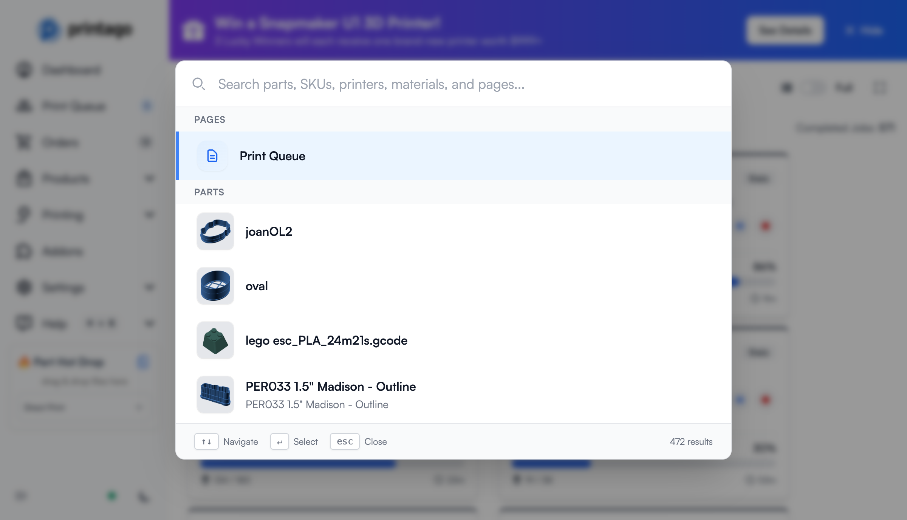
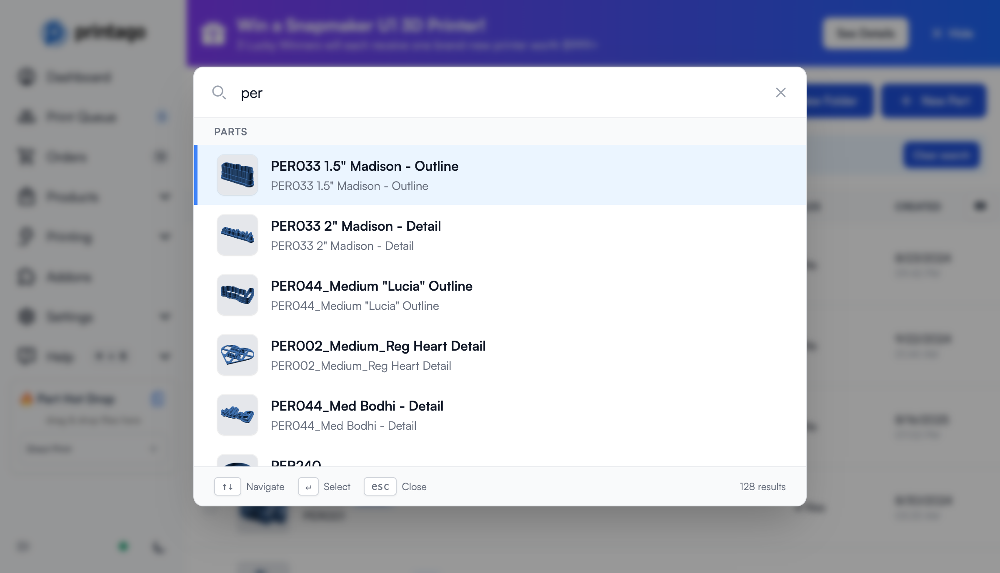

# Global Search

Instantly find and navigate to any content in your Printago workspace with keyboard-driven global search. Access parts, SKUs, printers, materials, and pages in seconds—without leaving your keyboard.

## Opening Global Search

There are two ways to open global search:

1. **Keyboard shortcut**: Press **`/`** from anywhere in Printago
2. **Search icon**: Click the magnifying glass icon at the bottom of the sidebar (next to the dark mode toggle)

The search input will automatically focus, ready for you to start typing.

:::tip Keyboard Shortcut
You can press `/` from any page except when you're already typing in a text field. This makes search instantly accessible no matter where you are in the application.
:::

## Searching Your Workspace

Start typing to filter results across all your content:

- **Parts** - Your 3D models and design files
- **SKUs** - Product assemblies and configurations
- **Printers** - Your printer fleet
- **Materials** - Material profiles and settings
- **Pages** - Key application pages like "Print Queue"

Results appear instantly as you type, grouped by category.

### Search Tips

- **Partial matching**: You don't need to type the full name—"bench" will find "Benchy"
- **No results?**: Try a different search term or check the spelling
- **Clear quickly**: Click the X button or delete your text to start fresh

## Keyboard Navigation

Global search is designed for speed with full keyboard support:

| Key | Action |
|-----|--------|
| **`/`** | Open search from anywhere |
| **`↑` `↓`** | Navigate through results |
| **`Enter`** | Go to the selected result |
| **`Esc`** | Close the search modal |

As you navigate with arrow keys, the list automatically scrolls to keep the selected item visible. The selected item is highlighted with a blue accent bar on the left.

:::info Mouse Navigation
You can also click any result to navigate to it, but keyboard navigation is usually faster once you get the hang of it.
:::

## Quick Navigation Patterns

### Jump to Print Queue
The fastest way to reach your print queue:
1. Press **`/`** to open search
2. Press **`Enter`** immediately (Print Queue is the first result)

### Find a Specific Part
1. Press **`/`** to open search
2. Type a few letters of the part name
3. Use **`↑` `↓`** to select the right part
4. Press **`Enter`** to navigate

### Search by SKU Code
1. Press **`/`** to open search
2. Type the SKU code (e.g., "PER235")
3. Press **`Enter`** to go to that SKU's page

## Search Categories Explained

### Parts
Shows your 3D models with thumbnail previews.

### SKUs
Displays product configurations with thumbnail previews.

### Printers
Lists all printers in your farm. Click to jump to printer management.

### Materials
Shows available materials. Access material profiles and settings.

### Pages
Quick access to key application pages like the Print Queue.

---

Global search transforms how you navigate Printago—making your workflow faster and keeping you in the flow of production.
