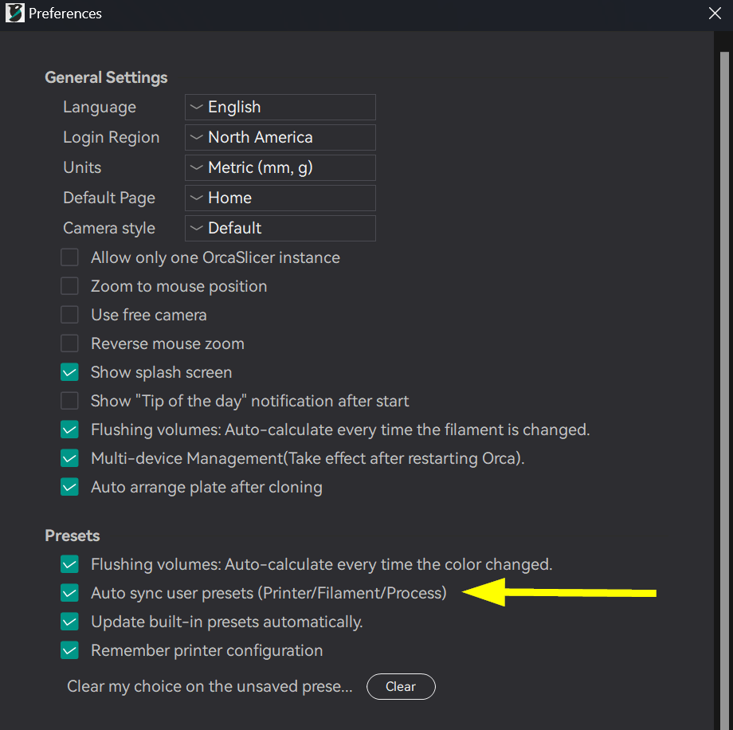
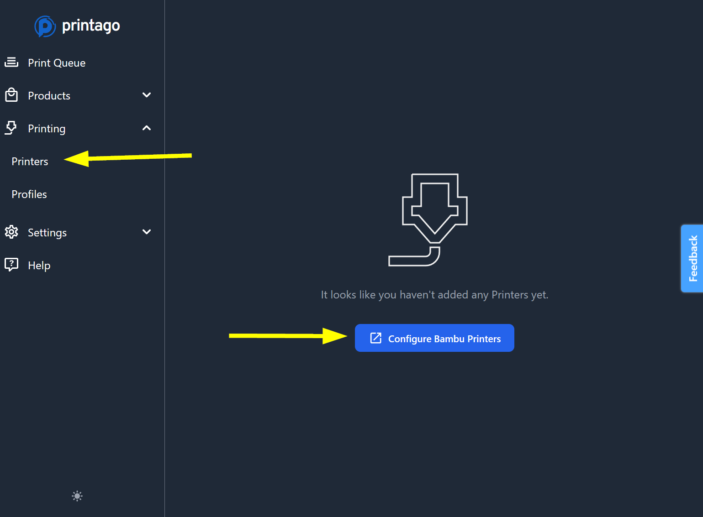
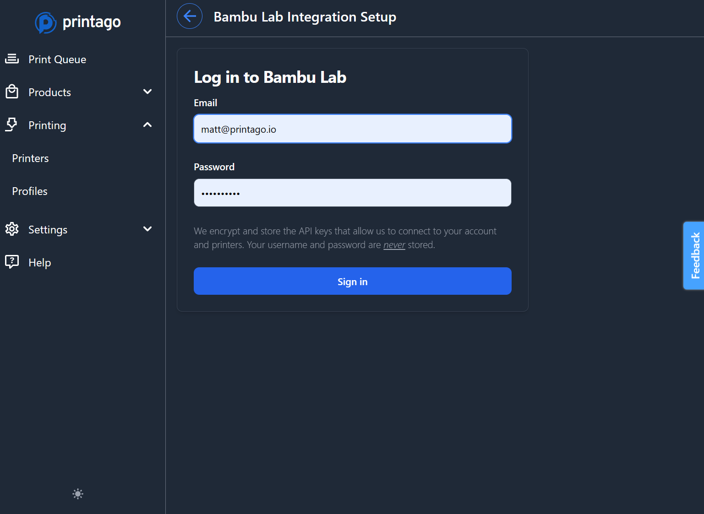
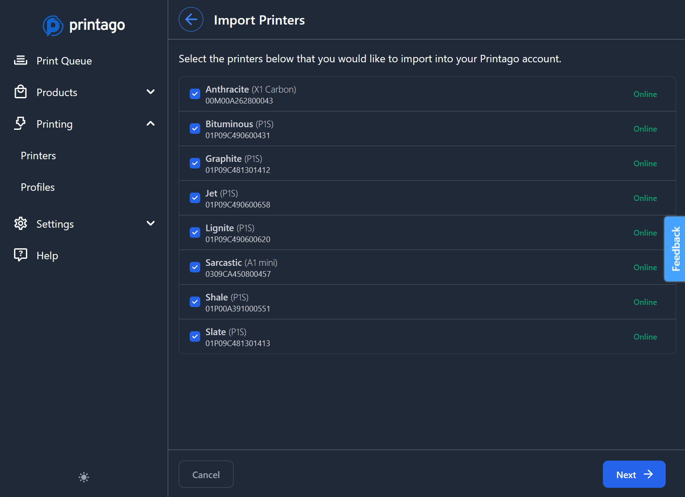
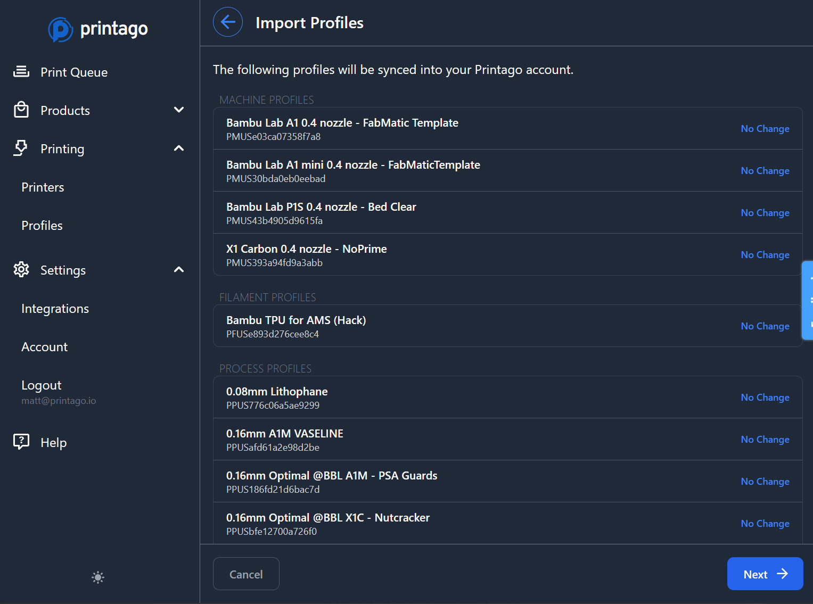
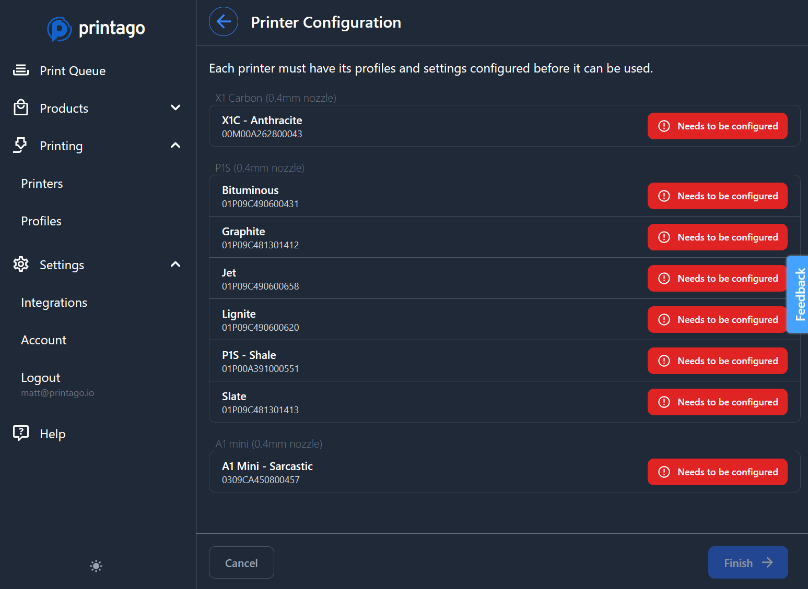
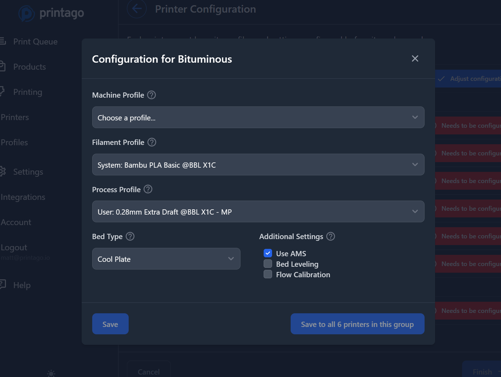

# Quick Start Guide

Get up and running with Printago in minutes. This guide walks you through the essential setup and your first print job.

## Before You Begin

:::important Prerequisites
Before starting with Printago, ensure you have:
1. Completed initial setup of your Bambu Lab printer(s)
2. Paired your printer(s) with your Bambu Cloud account
3. Enabled cloud profile syncing in your slicer  
:::

### Enable Cloud Profile Sync

Printago imports and syncs your slicing profiles from your Bambu Lab Account.  Want to change a slicing setting for all your parts? Or add a new printer model to your fleet and don't feel like slicing all your models for that printer?  Printago allows you to assign slicing profiles to ***parts***, all the slicing happens in the background automatically and on-demand!

In Orca Slicer or Bambu Studio:
1. Open Preferences
2. Navigate to Presets section
3. Enable "Auto sync user presets"

## Adding Your Printers & Profiles

:::tip Bulk Import
Printago imports all your Bambu Lab printers at once - no need to add them individually!
:::

1. Navigate to `Printers` in the sidebar
2. Click `Configure Bambu Printers`

3. Enter your Bambu Cloud credentials and complete Bambu's 2-Factor authentication as prompted

:::tip Free Unlimited Printers
Printago allows you to connect and use unlimited printers - free!  
:::
5. After authentication, you'll be taken through a short, two-step wizard allowing you to select which 3d printers to pair and profiles to import.

## Configuring Printer Defaults

Next we'll setup our printers configuration for slicing.  Familiar dropdown boxes will allow you to set a profile for `Printer`, `Filament`, and `Process`.

Printago uses these settings for slicing and material matching. 

All printago parts are sliced on-demand as needed based on your printer and part configurations.

:::tip Bulk Configuration
Use the `Save to all X printers in this group` option to quickly configure multiple identical printers of the same time at once.
:::
## Creating Your First Print

:::info File Support
Printago accepts 3MF, STL, STEP, OpenSCAD 
:::

<!--  -->

1. Go to Products → Parts
2. Click "Add Part"
3. Upload your file
4. Configure basic settings:
   - Name
   - Allowed filaments
   - Process profile

## Starting Prints

<!--  -->

### Printer Selection Options

- **Automatic**: Next available matching printer
- **Tagged**: Printers with specific tags
- **Manual**: Select specific printers

:::info Printer Matching
Printago automatically matches parts to compatible printers based on requirements like material type, nozzle size, and tags.
:::

## Queue Management

<!--  -->

### Basic Operations

- Select jobs using checkboxes
- Use bulk actions menu for multiple jobs
- Drag and drop to reorder priority

### Available Actions

1. **Pause Jobs**
   - Temporarily halt selected prints
   - Maintains queue position

2. **Resume Jobs**
   - Continue paused prints
   - Respects queue order

3. **Cancel Jobs**
   - Remove jobs from queue
   - Cannot be undone

:::warning Clear & Ready State
Printers must be marked "Clear & Ready" before they'll accept new jobs. This prevents accidentally starting prints on busy printers.
:::

## Next Steps

Join our Discord community to learn about advanced features:
- Parts and SKUs management
- Customization workflows
- FabMatic continuous printing
- Multi-printer management

:::tip Getting Help
Need assistance? Our Discord community is the fastest way to get help and learn from other users.
:::