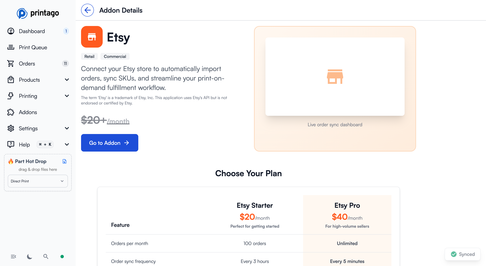
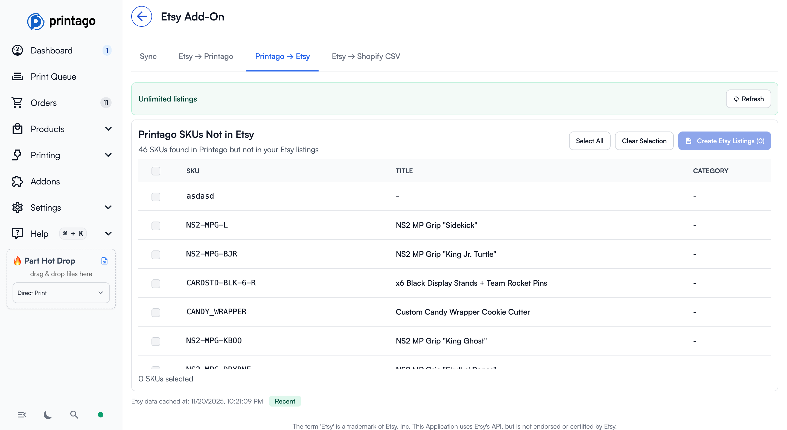
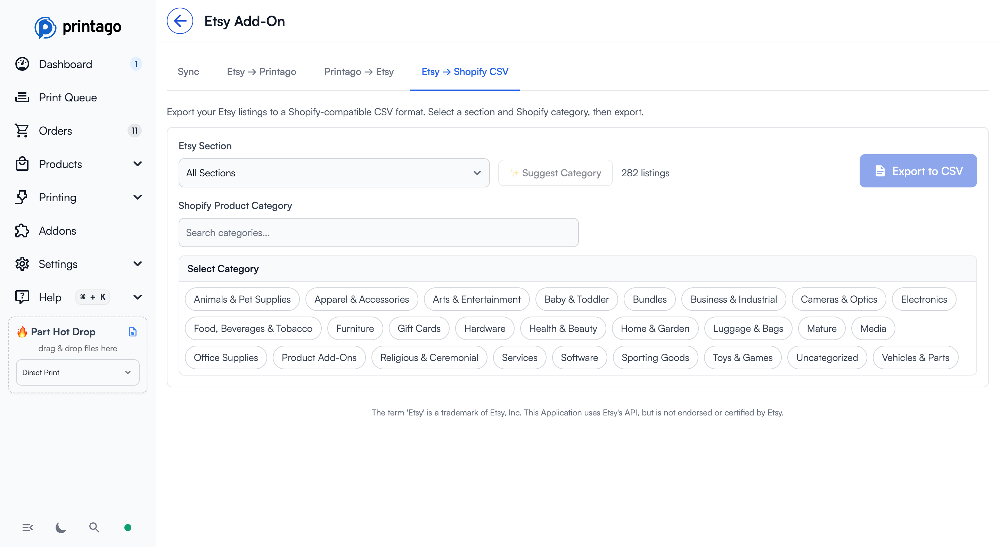

# Etsy Integration

Connect your Etsy shop to Printago for automated order processing, SKU management, and seamless print-on-demand fulfillment.

## Overview

The Etsy addon automatically syncs your Etsy orders to Printago, enabling streamlined fulfillment for print-on-demand products. Orders sync every 5 minutes, keeping your queue up to date with incoming orders.

:::info Free During Public Beta
The Etsy addon is currently **free** during the public beta period.
:::

## Getting Started

### 1. Activate the Addon

Navigate to **Addons** → **Etsy** and click "Activate Free During Beta" (or "Go to Addon" if already activated).

### 2. Connect Your Etsy Shop

Click the connect button to authenticate with Etsy using secure OAuth 2.0. You'll be redirected to Etsy to authorize Printago to access your shop.

### 3. Verify Connection

Once connected, you'll see:
- Your Etsy shop name
- Connection status (green checkmark)
- Last order sync time

## Features

### Automatic Order Sync

Orders from your Etsy shop automatically sync to Printago every 5 minutes.

**Synced orders appear in your Orders page** with the Etsy logo in the Source column:

#### Manual Sync

Click **"Fetch Orders Now"** to manually trigger an order sync at any time. This is useful when you want immediate updates without waiting for the automatic sync interval.

#### Sync Behavior

- Only **open orders** (not yet shipped) are synced by default
- Orders are matched to your Printago SKUs based on Etsy product variations
- Each order item creates a job in your print queue
- Order status updates automatically as jobs are completed

### Etsy → Printago: SKU Mapping

The **Etsy → Printago** tab shows all your Etsy listings and helps you map Etsy product variations to Printago SKUs.

**Key Information:**
- Total unique SKUs across all listings
- Number of variation values (e.g., size/color options)
- How many SKUs are already imported vs. need to be imported
- Filter by shop section or SKU status
- Sort by title, ID, or number of SKUs

**Actions:**
- Click **"Refresh All Listings"** to fetch the latest listings from Etsy
- Select listings to batch import SKUs
- Use the search bar to find specific products
- Filter by section to focus on specific product categories
- Click individual listings to expand and see variation details

### Printago → Etsy: Create Draft Listings

The **Printago → Etsy** tab shows Printago SKUs that don't exist in your Etsy shop yet.

**Features:**
- View all SKUs that exist in Printago but not in Etsy
- Select SKUs to create draft Etsy listings
- **"Create Etsy Listings"** button generates draft listings on Etsy
- Listings are created as drafts, giving you a chance to review and customize before publishing

### Etsy → Shopify CSV: Store Migration

The **Etsy → Shopify CSV** tab helps you migrate your Etsy products to Shopify.

**How it works:**
1. Select an Etsy section (or "All Sections")
2. Choose a Shopify product category from the taxonomy
3. Click **"Export to CSV"** to download a Shopify-compatible CSV file
4. Import the CSV into Shopify to migrate your products

**Features:**
- Search categories to quickly find the right classification
- Navigate through nested category hierarchies
- Optional **"Suggest Category"** button to auto-suggest based on your products

## Order Management

### Viewing Etsy Orders

Etsy orders appear in your main **Orders** page with:
- Etsy order number
- Customer information (can be hidden for privacy)
- Number of items
- Job status (queued, in progress, done, cancelled)
- Creation timestamp
- **Etsy logo** in the Source column

### Order Workflow

1. **Order synced** from Etsy → Appears in Orders page
2. **Jobs created** → Each order item becomes a job in your queue
3. **Jobs printed** → Mark jobs as complete as you fulfill them
4. **Order completed** → All jobs done, ready to ship

## Settings & Management

### Subscription Management

Click **"Manage Subscription"** to:
- View usage statistics (orders synced this month)
- Update billing information
- Manage your subscription

### Quick Actions

- **Copy Store Link** - Copy your Etsy shop URL to clipboard
- **Etsy Listings** - Quick link to view your listings on Etsy
- **Etsy Orders** - Quick link to view orders on Etsy
- **Disconnect** - Remove the Etsy integration

## Tips & Best Practices

### SKU Management
- Import all your Etsy listing SKUs before your first order sync
- Keep SKU names consistent between Etsy and Printago
- Use the filter options to identify missing SKUs
- Regularly refresh listings to catch new products

### Order Processing
- Enable the Source column in Orders to easily identify Etsy orders
- Check order sync status before printing to ensure you have latest updates
- Use bulk actions to process multiple Etsy orders at once

### Migration to Shopify
- Export one section at a time for better organization
- Review and test CSV imports on a development Shopify store first
- Use accurate category mappings to improve product discoverability

## Troubleshooting

### Orders Not Syncing

1. Check your connection status in the Sync tab
2. Verify your subscription is active
3. Try manual sync with "Fetch Orders Now"
4. Check that orders are marked as "Open" in Etsy

### SKU Mismatches

1. Go to Etsy → Printago tab
2. Search for the product listing
3. Verify the SKU exists in both systems
4. Check that variation names match exactly
5. Re-import the listing if needed

### Connection Issues

If you see "Disconnected":
1. Click the connect button to re-authenticate
2. Ensure you're logged into the correct Etsy account
3. Check that you've granted all necessary permissions
4. Contact support if issues persist

## Support

Need help with your Etsy integration?

- Join our [Discord community](https://discord.gg/RCFA2u99De)
- Email support for setup consultation (included in your plan)
- Check the [support page](/docs/support) for additional resources

## Technical Details

### OAuth 2.0 Authentication
Printago uses industry-standard OAuth 2.0 to securely connect to your Etsy shop. We never store your Etsy password.

### Sync Frequency
- **Automatic**: Every 5 minutes
- **Manual**: On-demand via "Fetch Orders Now"

### Data Privacy
Customer information is handled according to Etsy's API terms of service and Printago's privacy policy. You can hide the customer column in the Orders view for additional privacy.

---

*The term 'Etsy' is a trademark of Etsy, Inc. This application uses Etsy's API but is not endorsed or certified by Etsy.*
