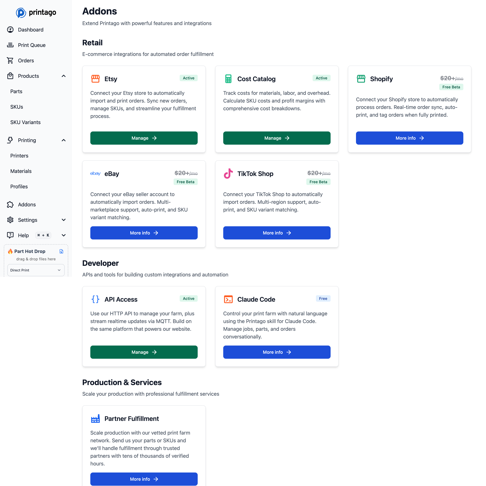
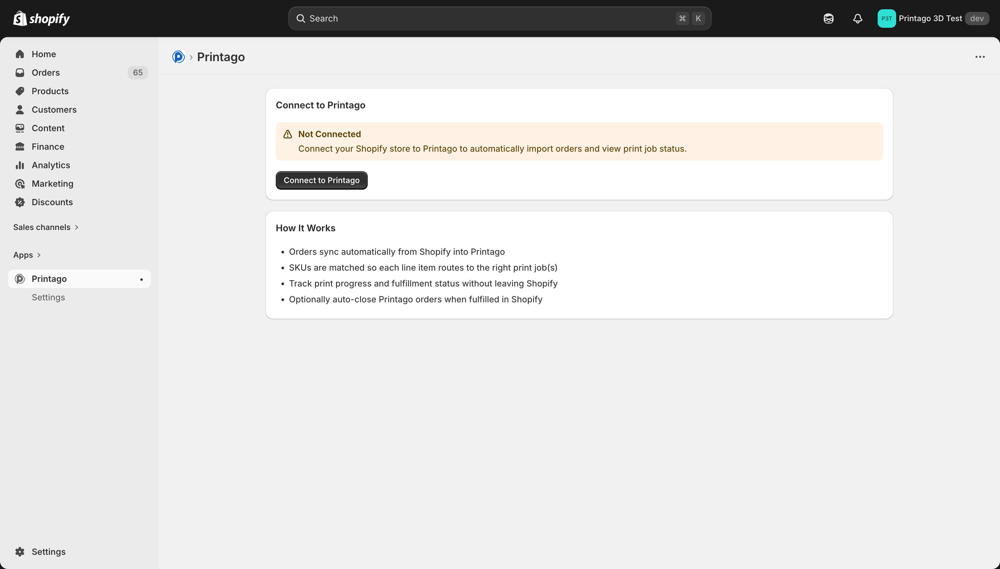
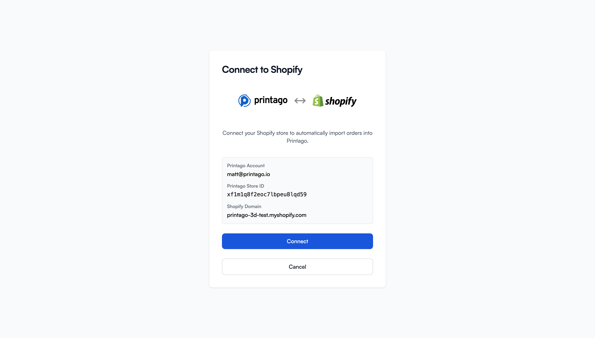
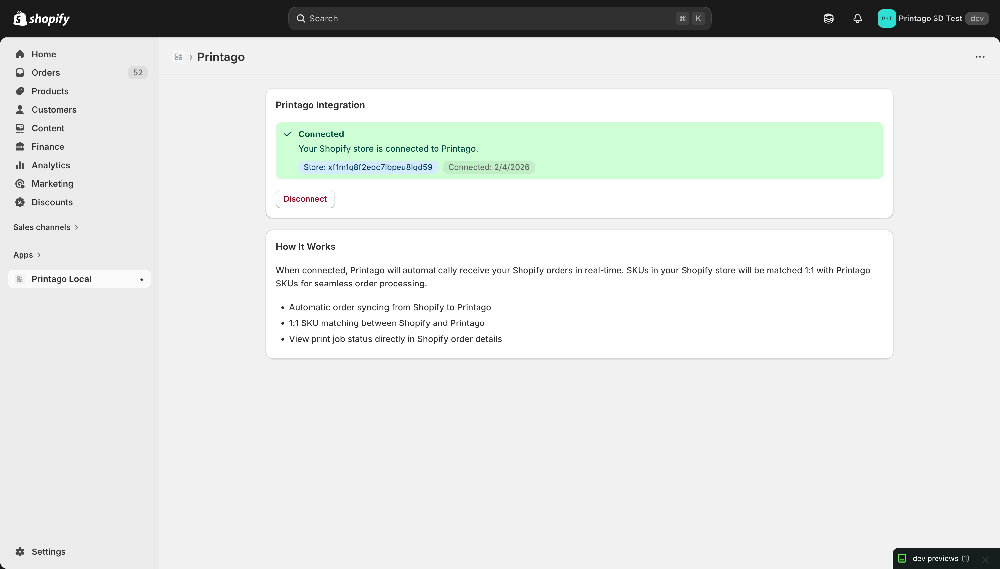
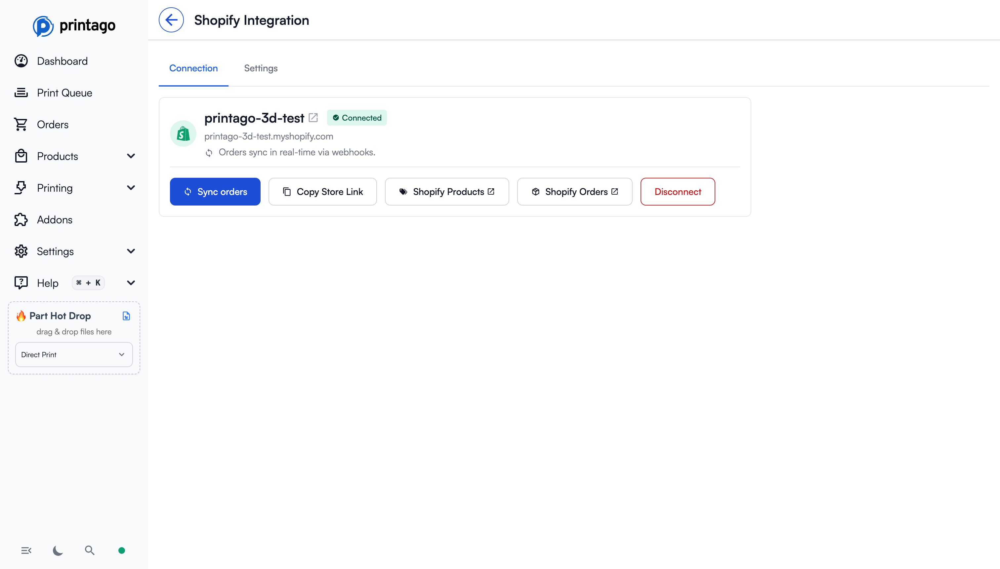
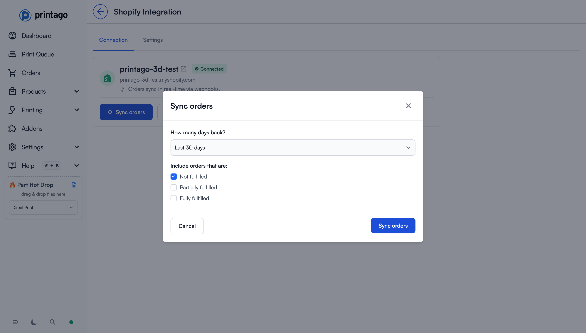
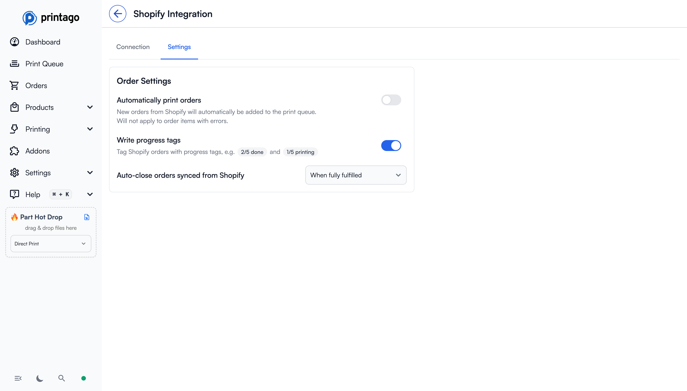
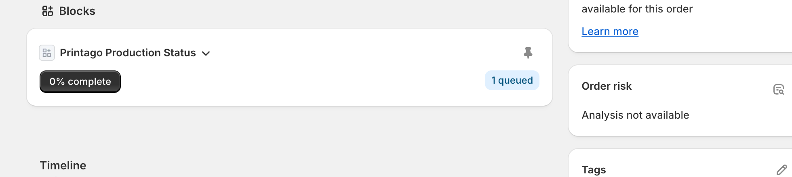
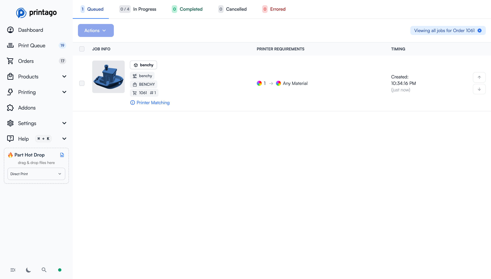
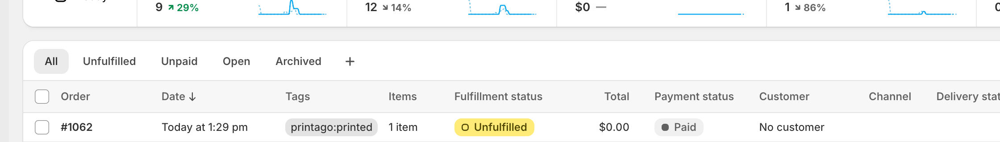

# Shopify Integration

:::tip Commercial Feature 💎
Integrations require a Commercial subscription. [Learn more](/docs/settings/subscription-management)
:::

Connect your Shopify store to Printago so orders flow directly into your production workflow.

## What You Get

- Real-time order sync from Shopify to Printago
- Manual backfill sync for historical orders
- Automatic queueing (optional) for new valid order items
- Progress tags written back to Shopify (optional)
- Auto-close behavior for synced orders (optional)

## Before You Start

- You have access to a Printago account with Commercial features enabled
- You have admin access to your Shopify store
- Your Shopify SKUs are mapped to SKUs in Printago (exact SKU match)

## Connect Shopify to Printago

### 1) Open Shopify integration in Printago

In Printago, go to **Addons** and open **Shopify**.

### 2) Connect from Shopify app

In your Shopify Admin, open the **Printago** app and click **Connect to Printago**.

Then confirm the account binding in Printago:

### 3) Verify connected status

After connecting, you should see a connected state in both places:

- Shopify app:

- Printago > Shopify > **Connection** tab:

## Sync Orders

### Manual sync (recommended first sync)

1. In Printago, go to **Shopify > Connection**.
2. Click **Sync orders**.
3. Choose:
   - **How many days back** (for example, 30 days)
   - Fulfillment states to include (Not fulfilled / Partially fulfilled / Fully fulfilled)
4. Click **Sync orders**.

### Real-time sync

After connection, new Shopify orders sync automatically via webhooks (no manual action needed).

## Integration Settings

In Printago, open **Shopify > Settings**:

- **Automatically print orders**: Adds valid new order items to the print queue automatically.
- **Write progress tags**: Writes stable progress tags back to Shopify (`printago:in_progress` and `printago:printed`).
- **Auto-close orders synced from Shopify**:
  - When fully fulfilled
  - When any fulfillment occurs
  - Never

## Shopify Order Progress UI

When you open an order in Shopify, the Printago app block shows a **Printago Production Status** card.

If you click the progress badge (for example, `0% complete`), it opens Printago Queue filtered to that specific Shopify order.

You can also see the written progress tags directly in the Shopify orders list.

## SKU Variant Support

For **SKU Variants**, Shopify integration supports **SKU suffix mapping only**.

- Each variant option/value combination in Printago must have a **SKU suffix** defined
- Each Shopify variant must have a **SKU value** defined in Shopify
- If either side is missing (no suffix in Printago or no variant SKU in Shopify), mapping will fail

## Disconnect

You can disconnect at any time:

- In Shopify app: click **Disconnect**
- In Printago **Shopify > Connection**: click **Disconnect**

Disconnecting stops future syncs but does not remove historical orders already imported.

## Troubleshooting

### Store shows as not connected

- Re-run connect flow from Shopify app (**Connect to Printago**)
- Confirm you are logged into the intended Printago account
- Make sure you approved the correct Shopify store during binding

### Orders are not syncing

- Check connection status in Printago **Shopify > Connection**
- Run a manual sync with a wider date range
- Verify orders match selected fulfillment states in the sync modal

### Items are red / not printable

- SKU mismatch between Shopify and Printago
- Create or correct SKU mappings in Printago, then re-sync or refresh orders

## Need Help?

- [Support](/docs/support)
- [SKU Management](/docs/commerce/sku-management)
- [Orders](/docs/commerce/orders)
