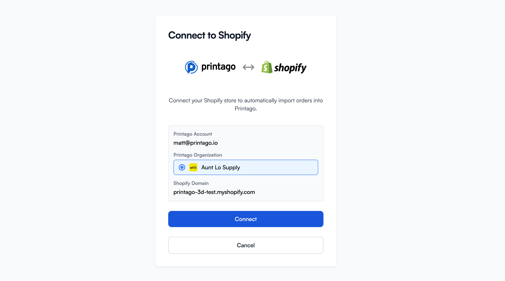
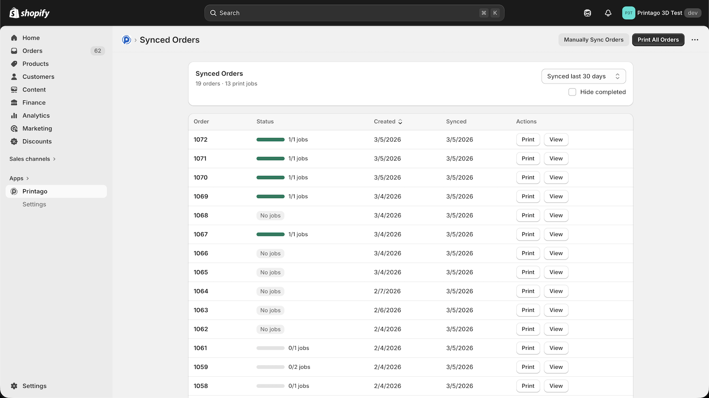
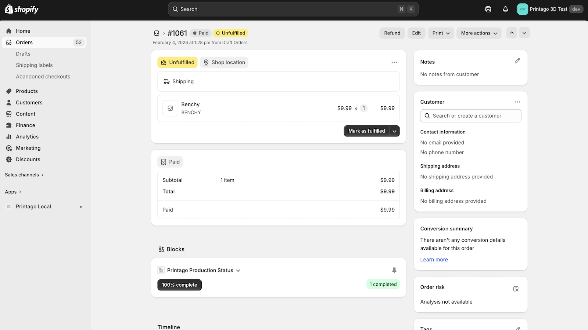
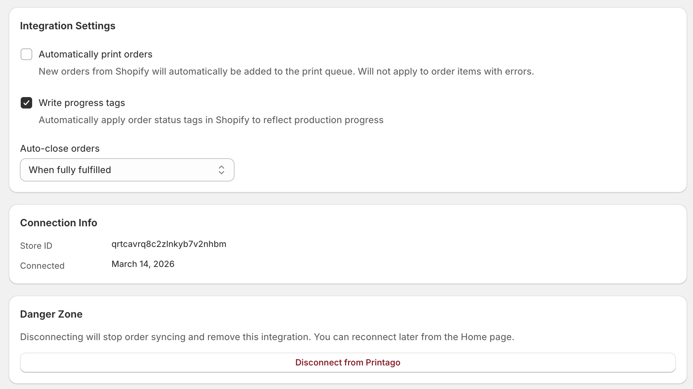
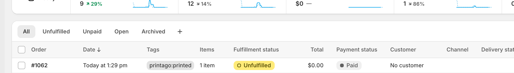

# Shopify Integration

:::tip Commercial Feature
Integrations require a Commercial subscription. [Learn more](/docs/settings/subscription-management)
:::

## Key Concepts

The **Shopify integration** connects your Shopify storefront directly to Printago's production system so that incoming customer orders automatically generate print jobs. When a customer purchases a product, the integration syncs the order to Printago, matches the Shopify SKU to your Printago SKU definitions, and optionally queues the resulting jobs for production immediately.

The Printago Shopify app runs directly inside your Shopify Admin panel, giving you a **Synced Orders dashboard** to monitor order and job status, a **Settings page** to configure automation behavior, and a **Production Status block** on each order detail page to track print progress — all without leaving Shopify.

## What You Get

- Real-time order sync from Shopify to Printago
- Manual backfill sync for historical orders with date range and fulfillment status filters
- Synced Orders dashboard with job progress tracking inside Shopify Admin
- Per-order Production Status block showing print completion
- Automatic queueing (optional) for new valid order items
- Progress tags written back to Shopify (optional)
- Auto-close behavior for synced orders (optional)

## Before You Start

- You have access to a Printago account with Commercial features enabled
- You have admin access to your Shopify store
- Your Shopify SKUs are mapped to SKUs in Printago (exact SKU match or suffix match)

## Connect Shopify to Printago

### 1. Install the Printago app in Shopify

In your Shopify Admin, install the **Printago** app from the [Shopify App Store](https://apps.shopify.com/printago).

### 2. Connect from the Shopify app

Open the **Printago** app in your Shopify Admin. You'll see a welcome screen with a **Connect to Printago** button. Click it to begin the connection flow.

A popup window will open where you confirm the account binding in Printago:

Select your Printago organization and click **Connect**. Once confirmed, the app stores your credentials and redirects you to the Synced Orders dashboard.

### 3. Verify connected status

After connecting, the app automatically redirects to the **Orders** page. You can verify your connection details in **Settings**, which shows your Printago store name, store ID, and connection date.

## Synced Orders Dashboard

The **Orders** page is the main interface of the Printago Shopify app. It shows all orders synced between Shopify and Printago along with their print job status.

### Dashboard Features

- **Order count and job summary** at the top, including total orders and print jobs
- **Date range filter** — view orders synced in the last 7, 14, 30, 60, or 90 days
- **Hide completed** checkbox to focus on in-progress work
- **Sortable columns** — Order number, Status, Created date, Synced date

### Order Status

Each order row shows a progress bar and job count (e.g., "1/1 jobs") indicating how many print jobs are complete. Orders with no matching SKUs show "No jobs".

### Actions

- **Print** — queue an individual order's items to the print queue
- **View** — open the order in Printago for full details
- **Print All Orders** — bulk-queue all visible orders to print
- **Manually Sync Orders** — open a sync modal to import historical orders

### Manual Sync

Click **Manually Sync Orders** to import existing orders. You can configure:
- **How many days back** — 7, 14, 30, 60, or 90 days
- **Fulfillment status filter** — Unfulfilled, Partially fulfilled, Fully fulfilled

This is useful for your first sync or to catch up on orders placed before the integration was connected.

### Real-time Sync

After connection, new Shopify orders sync automatically via webhooks with no manual action needed.

## Order Production Status

When you open an individual order in Shopify, the Printago app block displays a **Printago Production Status** card showing print completion progress for that order.

The status block shows:
- **Completion percentage** (e.g., "100% complete")
- **Job count** (e.g., "1 completed")

Clicking the progress badge opens Printago's Queue filtered to that specific order.

## Settings

Open **Settings** from the Printago app navigation to configure integration behavior.

### Automatically Print Orders

When enabled, new orders from Shopify are automatically added to the print queue. Order items with SKU errors are skipped.

### Write Progress Tags

When enabled, Printago automatically applies order status tags in Shopify to reflect production progress (e.g., `printago:in-progress`, `printago:printed`). These tags are visible in your Shopify orders list.

### Auto-close Orders

Controls when Printago orders are automatically closed based on Shopify fulfillment status:
- **Never** — do not auto-close
- **When fully fulfilled** — close when all items in the Shopify order are fulfilled
- **When partially fulfilled** — close when any items are fulfilled

### Connection Info

The Settings page also shows your connection details:
- Printago store name
- Store ID
- Connected date

### Disconnect

Click **Disconnect from Printago** in the danger zone at the bottom of Settings to remove the integration. This stops future syncs but does not remove historical orders already imported into Printago.

## SKU Variant Support

The Shopify integration supports two methods for resolving product variants, and both can work simultaneously:

### Option-based matching

When a Shopify order comes in, Printago fetches the variant's selected options (e.g., Color=Red, Size=Large) directly from Shopify and matches them to your [SKU Variant](/docs/commerce/sku-variants) definitions in Printago.

This is the simplest setup — just make sure your Shopify option names and values exactly match your Printago variant names and values. See [SKU Variant name matching](/docs/commerce/sku-variants#name-matching) for details.

### SKU suffix matching

If your Shopify variants use compound SKU codes (e.g., `WIDGET-001-RED-LG`), Printago can also resolve variants by parsing the SKU suffix:

- Each variant option/value combination in Printago must have a **SKU suffix** defined
- Each Shopify variant must have a **SKU value** defined in Shopify
- Printago automatically resolves compound SKUs by matching the base SKU and suffix options

**Example:**
- Printago SKU: `WIDGET-001`
- Color option: Red (suffix: `-RED`), Blue (suffix: `-BLUE`)
- Size option: Small (suffix: `-SM`), Large (suffix: `-LG`)
- Shopify variant SKU: `WIDGET-001-RED-LG` resolves to WIDGET-001 with Color=Red, Size=Large

### How resolution works

When a Shopify order arrives, Printago resolves each line item's SKU in this order:

1. **Exact SKU match** — Printago looks for a SKU with a code that exactly matches the Shopify variant's SKU (e.g., `WIDGET-001`). If found, the variant's selected options (Color, Size, etc.) are passed through for validation.
2. **Suffix match** — If no exact match is found, Printago tries to parse the SKU as a base code plus suffixes (e.g., `WIDGET-001-RED-LG` → base SKU `WIDGET-001` with Color=Red, Size=Large). The parsed options replace any options from Shopify.

If you use a single SKU code across all variants (e.g., every variant uses `WIDGET-001`), option-based matching handles everything automatically. If each variant has its own compound SKU code (e.g., `WIDGET-001-RED-LG`), suffix matching kicks in.

## Troubleshooting

### Store shows as not connected

- Re-run the connect flow from the Shopify app
- Confirm you are logged into the intended Printago account
- Check Settings to verify connection status

### Orders are not syncing

- Check connection status in Settings
- Run a manual sync with a wider date range
- Verify orders match the selected fulfillment states

### Items show errors or "No jobs"

- SKU mismatch between Shopify and Printago
- Create or correct SKU mappings in Printago, then re-sync
- Check that variant SKU suffixes are defined on both sides

### Print action fails

- Open the error details shown in the app banner
- Click "Fix in Printago" to resolve SKU or configuration issues
- Re-try printing after fixing errors

## Need Help?

- [Support](/docs/support)
- [SKU Management](/docs/commerce/sku-management)
- [SKU Variants](/docs/commerce/sku-variants)
- [Orders](/docs/commerce/orders)
