# Printago Fuse

:::info Beta Software
Printago Fuse is currently in private beta and not yet publicly available. This documentation is for beta testers and early access participants.
:::

Printago Fuse is a local client that bridges your Bambu Lab 3D printers to Printago. It runs on your local network and handles all communication with your printers.

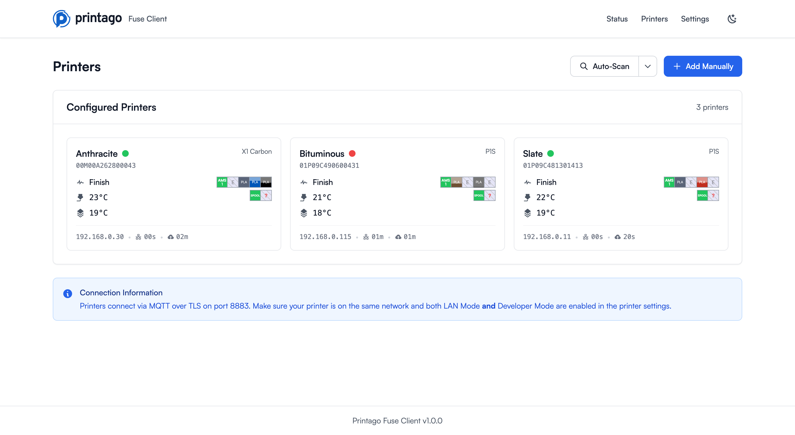

## Prerequisites

Before setting up Fuse, ensure your Bambu Lab printers have:
- **LAN Mode** enabled
- **Developer Mode** enabled

These settings can be configured in your printer's settings menu.

### Network Requirements

Fuse requires the following network ports for printer communication:

| Port | Protocol | Purpose |
|------|----------|---------|
| 8883 | MQTTS | Printer control and status updates |
| 990 | FTPS | File transfer (print jobs) |
| 1990, 2021 | SSDP | Printer auto-discovery |
| 6000 | RTSP | Live camera stream |

## Activation

When you first launch Fuse, you'll need to connect it to your Printago account.

### Activation Process

1. **Start Fuse Client**: Launch the Fuse application. You'll see an activation screen displaying a unique activation code (e.g., `SQMA-VR2N`) and an expiration timer.

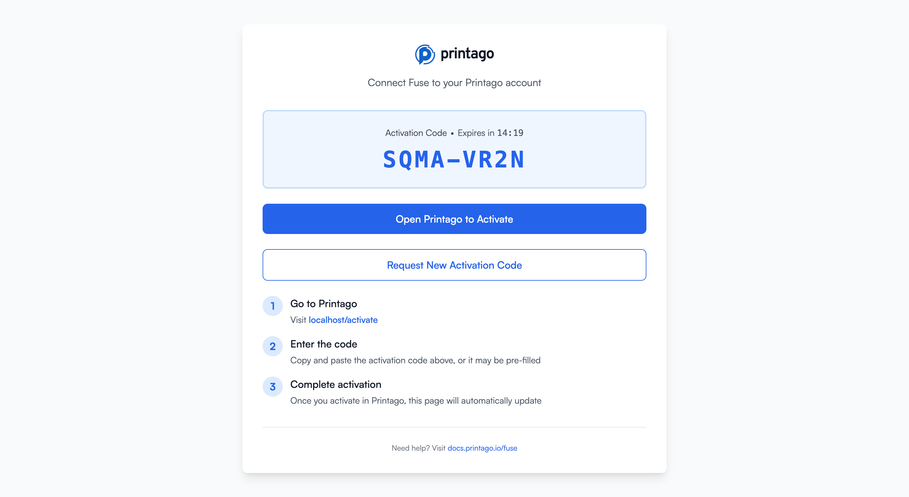

2. **Activate in Printago**: You have two options to complete activation:

   **Option A: Click the activation link**
   - Click the "Open Printago to Activate" button on the Fuse screen
   - This will open your browser to `app.printago.io/activate` with the code pre-filled

   **Option B: Manual entry**
   - Navigate to `app.printago.io/activate` in your browser
   - Enter the activation code displayed in Fuse
   - Click activate

3. **Confirmation**: Once activated, both the Printago web interface and your Fuse client will display "Activation Successful!" The Fuse interface will automatically update to show the status dashboard.

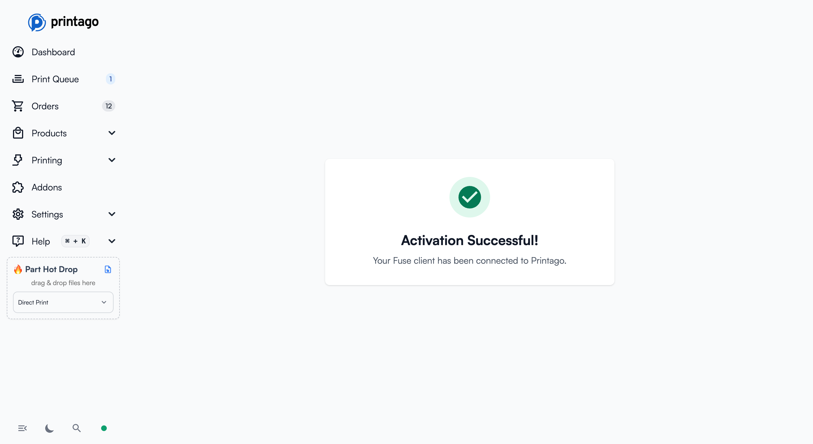

4. **Request New Code**: If your activation code expires (codes are valid for 15 minutes), click "Request New Activation Code" to generate a fresh one.

## Status Dashboard

After activation, the Fuse Status page displays three key indicators:

- **Printers**: Shows the count of connected printers (e.g., "8 connected")
- **Fuse Client (LAN)**: Indicates whether the local Fuse service is running
- **Printago (Cloud)**: Shows connection status to the Printago cloud gateway

All three indicators should show positive status (Connected/Running) for full functionality.

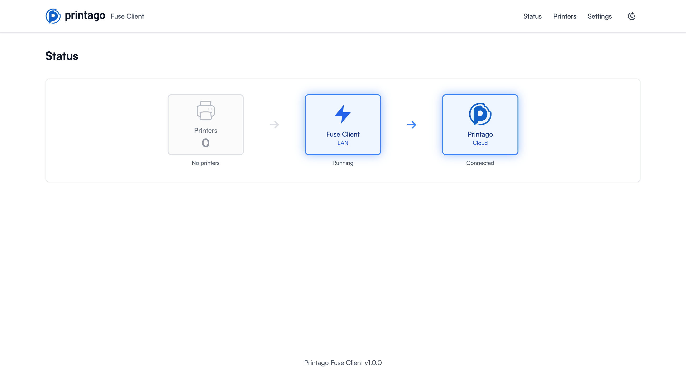

## Adding Printers

Fuse supports multiple methods to add printers. Navigate to the **Printers** page using the top navigation menu.

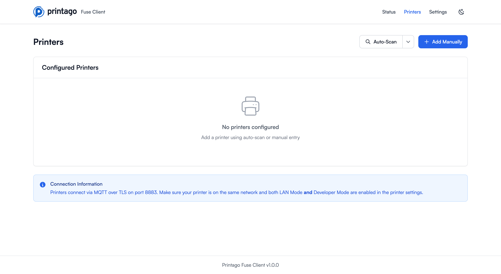

### Adding Physical Printers

#### Method 1: Auto-Scan (Recommended)

The fastest way to discover Bambu Lab printers on your local network using SSDP discovery.

1. Click the **Auto-Scan** button in the top right
2. Fuse will scan your local network for compatible Bambu Lab printers
3. Discovered printers will be displayed with their IP address, model, and serial number
4. Select the printers you want to add and provide their access codes
5. Click "Add Selected Printers" to complete the setup

#### Method 2: Subnet Search

If auto-scan doesn't find your printers (e.g., they're on a different subnet), use a custom subnet scan.

1. Click the dropdown arrow next to **Auto-Scan**
2. Select **Scan Custom Subnet**
3. Enter your subnet in CIDR notation (e.g., `192.168.0.0/24`)
4. Click **Scan**
5. Fuse will probe each IP address on port 8883 for Bambu Lab printers
6. Follow the same selection process as auto-scan

**Common subnet examples:**
- `192.168.0.0/24` - Scans 192.168.0.1 through 192.168.0.254
- `192.168.1.0/24` - Scans 192.168.1.1 through 192.168.1.254
- `10.0.1.0/24` - Scans 10.0.1.1 through 10.0.1.254

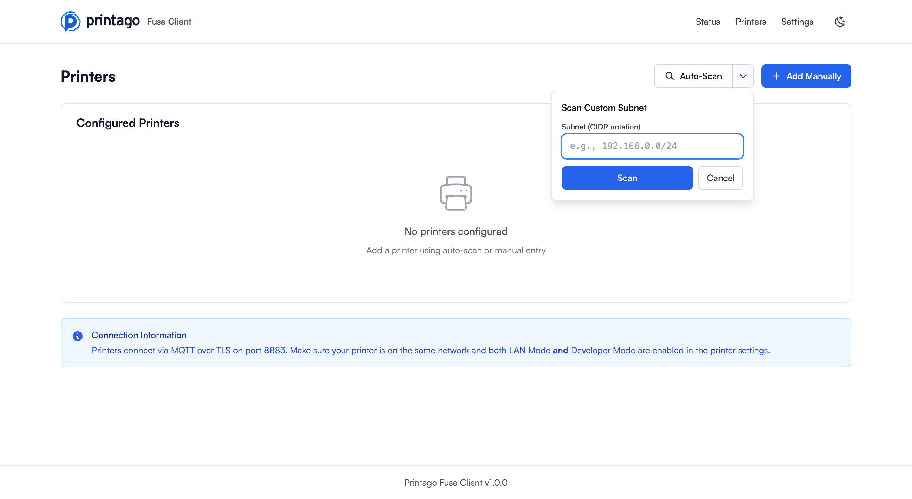

#### Method 3: Add Manually

For printers that aren't discovered automatically, or when you prefer manual configuration.

1. Click **Add Manually** in the top right
2. Select **Physical Printer** from the dropdown

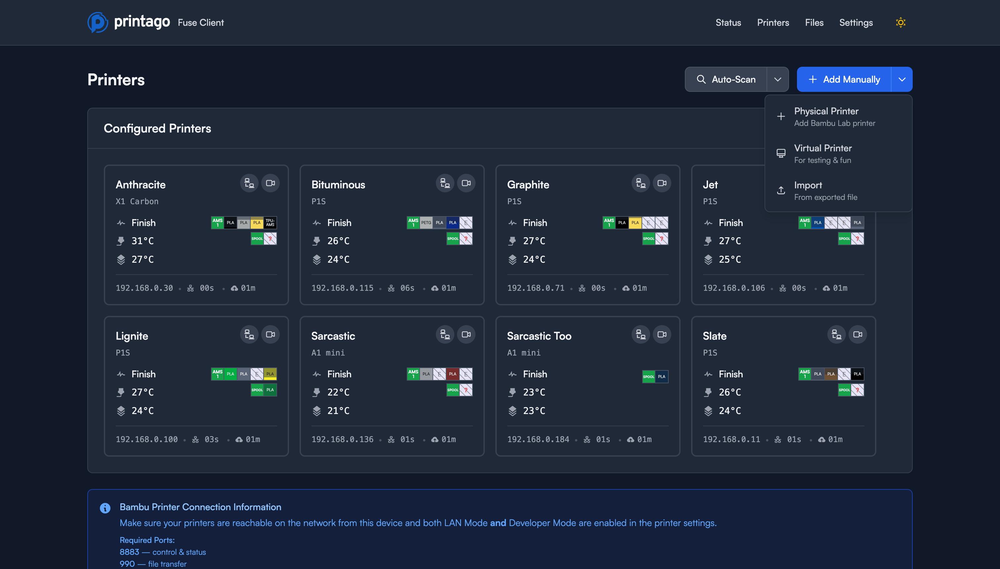

3. Fill in the printer details:
   - **Printer Name**: A friendly name for your printer (e.g., "Workshop X1 Carbon")
   - **IP Address**: The local network IP address of your printer (e.g., `192.168.0.30`)
   - **Model**: Select your printer model from the dropdown:
     - X1 Carbon
     - X1
     - P1P
     - P1S
     - A1 Mini
     - A1
     - Other
   - **Device Serial Number**: Automatically extracted once you enter a valid IP address
   - **Access Code**: Your printer's 8-digit access code (found in printer settings)
4. Click **Add Printer** to save the configuration

### Adding Virtual Printers

Virtual printers are simulated printers useful for testing and demonstration purposes. You can create up to 20 virtual printers per Fuse client.

1. Click **Add Manually** in the top right
2. Select **Virtual Printer** from the dropdown
3. Enter a name for your virtual printer
4. Click **Add Printer**

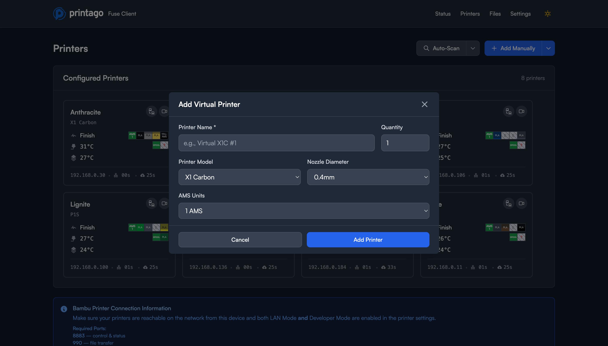

Virtual printers appear in your printer list just like physical printers and can be used to test workflows without affecting real equipment.

### Importing Configuration

To import printer configurations from a backup or another Fuse instance:

1. Click **Add Manually** in the top right
2. Select **Import** from the dropdown
3. Select your configuration file
4. Review and confirm the imported printers

## Managing Printers

### Printer Cards

The Printers page displays all your configured printers as cards showing:

- **Header**: Printer name, model icon, and connection status indicator
- **Status**: Current printer state (Idle, Printing, etc.)
- **IP Address**: Network address of the printer
- **Serial Number**: Unique device identifier
- **Temperatures**: Real-time nozzle, bed, and chamber temperatures
- **AMS Status**: Filament slots with colors and material types
- **MQTT Timing**: Connection statistics (Connected At, Last Received, Reconnects)

### Printer Actions

Each printer card includes action buttons:

- **Camera**: View the printer's live camera feed directly in the card
- **Communications**: Access MQTT message logs for debugging
- **Edit**: Modify printer configuration
- **Delete**: Remove the printer from Fuse

### Live Camera View

Click the camera icon on any printer card to view the live camera feed. The video stream is embedded directly in the printer card.

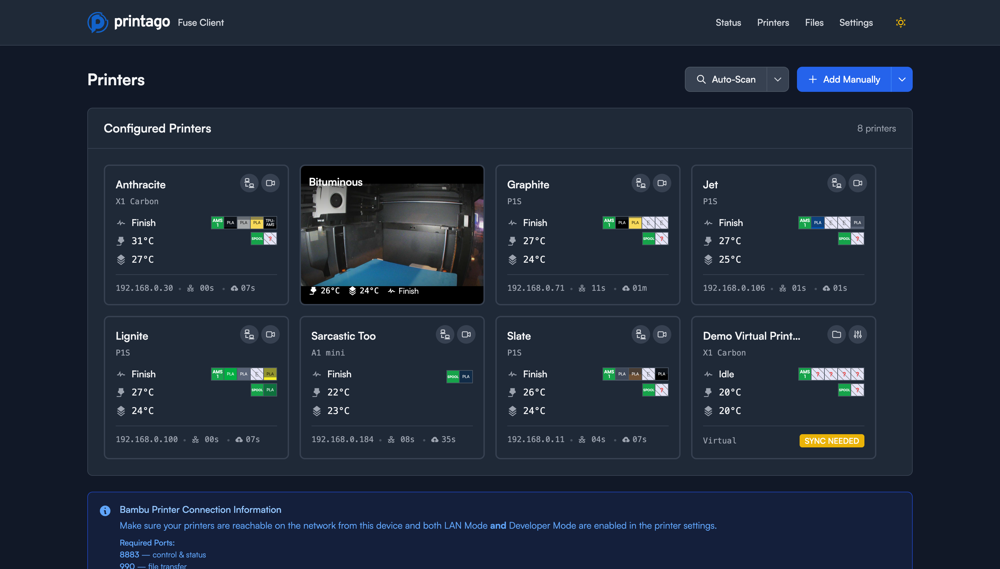

### MQTT Communications

The Communications view shows real-time MQTT messages between Fuse and the printer. This is useful for troubleshooting and understanding printer behavior.

Click on any message to see the parsed JSON data with full printer state information including:
- Print stage and progress
- Temperature readings
- Fan speeds
- AMS configuration
- Error states

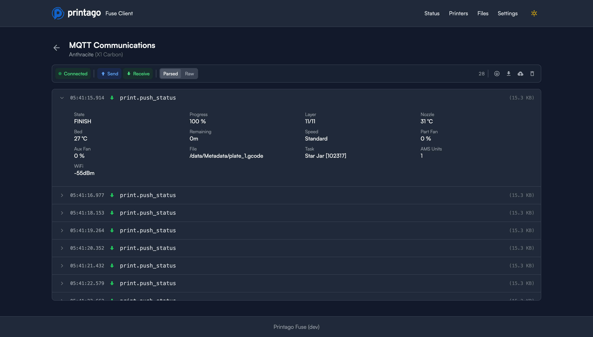

### Virtual Printer Controls

Virtual printers include additional simulation controls accessed via the gear icon:

- **Online/Offline Toggle**: Simulate printer connectivity
- **Set HMS Error**: Trigger simulated printer errors for testing
- **Clear HMS Errors**: Remove simulated errors
- **Start Test Print**: Begin a simulated print job

### Editing Printer Settings

Click the edit icon next to any printer to modify its configuration. You can update:
- Printer name
- IP address (if the printer's network address changes)
- Access code

### Removing Printers

Click the delete icon to remove a printer from your Fuse configuration. This only removes the printer from Fuse; it doesn't affect the physical printer or any data in Printago.

## Files

The Files page shows all cached print files on your Fuse client.

For each file, you can see:
- **Filename**: The original print file name
- **Size**: File size on disk
- **Created**: When the file was cached

Actions available:
- **Download**: Save the file to your computer
- **Delete**: Remove the file from the cache

Cache settings can be adjusted in the Settings page.

## Settings

Access the Settings page from the top navigation menu to manage your Fuse client.

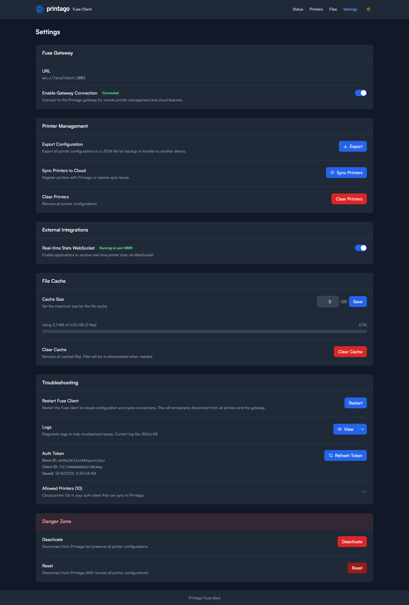

### Fuse Gateway

- **Fuse Gateway URL**: The endpoint for cloud connectivity (default: gateway.printago.io)
- **Enable Gateway Connection**: Toggle to enable/disable cloud sync with Printago

### Printer Management

- **Export Configuration**: Download your printer configurations as a backup file
- **Sync Printers to Cloud**: Manually trigger a sync of all printer data to Printago
- **Clear Printers**: Remove all printer configurations from this Fuse client

### External Integrations

- **Real-time Stats WebSocket**: Enable a WebSocket server on port 8889 for external applications to receive live printer data

### File Cache

- **Cache Size**: Set the maximum cache size in GB (e.g., 10 GB)
- **Usage Display**: Shows current cache usage
- **Clear Cache**: Remove all cached files

### Troubleshooting

- **Restart Fuse Client**: Restart the client to reload configuration and cycle connections. Use when troubleshooting connection issues or after configuration changes.
- **Logs**: View and download Fuse logs for debugging
- **Auth Token**: Shows your current authentication token for support purposes
- **Allowed Printers**: Display the list of printer IDs this client is authorized to manage

### Danger Zone

The following operations are destructive. Use with caution.

**Deactivate**
- Disconnects this Fuse client from your Printago account
- Preserves all printer configurations locally
- Your printers remain configured but won't sync with Printago
- You'll need to reactivate to sync with Printago again
- Use when temporarily disconnecting Fuse or switching accounts

**Reset**
- Complete reset: disconnects from Printago AND removes all printer configurations
- Returns Fuse to its initial state
- You'll need to reactivate and reconfigure all printers from scratch
- Use when setting up a new account or troubleshooting severe issues

## Troubleshooting

### Printers Not Discovered

If auto-scan isn't finding your printers:

1. Verify printers are on the same network as your Fuse client
2. Confirm LAN Mode and Developer Mode are enabled on the printer
3. Check that your firewall allows SSDP traffic (UDP ports 1990, 2021)
4. Try a custom subnet scan with your network's subnet
5. As a last resort, add the printer manually if you know its IP address

### Connection Issues

If Fuse shows as disconnected from Printago:

1. Check your internet connection
2. Verify the Fuse client is running (check Status page)
3. Try restarting the Fuse client from Settings
4. Check that the Gateway URL is correct in Settings
5. If issues persist, deactivate and reactivate

### Printer Won't Connect

If a configured printer shows as disconnected:

1. Verify the printer is powered on and connected to the network
2. Check that the IP address hasn't changed (some networks use dynamic IPs)
3. Confirm the access code is correct
4. Ensure LAN Mode and Developer Mode are enabled
5. Check that port 8883 isn't blocked by your firewall
6. View the MQTT Communications to diagnose connection issues
7. Try removing and re-adding the printer

### File Upload Issues

If files are stuck being sent to the printer or fail to upload:

**For P2S Printers:**
- **USB storage is required**: The P2S model requires a USB storage device to be plugged into the printer for file uploads to work. Without USB storage, files cannot be uploaded successfully.
- Verify a USB drive is connected to the printer
- Check that the USB drive is properly mounted and recognized by the printer

**General File Upload Issues:**
- Check the upload progress and error messages in the Fuse logs (Settings → Logs)
- Verify the printer has sufficient storage space
- Ensure the network connection is stable between Fuse and the printer

### Camera Not Loading

If the camera feed doesn't appear:

1. Verify the printer camera is enabled in printer settings
2. Check that port 6000 isn't blocked by your firewall
3. Some networks may block RTSP streams; try from a different network
4. Restart the printer if the issue persists

## Technical Details

- **Control Protocol**: MQTT over TLS (port 8883)
- **File Transfer**: FTP over TLS (port 990)
- **Discovery**: SSDP (UDP ports 1990, 2021)
- **Camera Stream**: RTSP (port 6000)
- **Stats API**: WebSocket (port 8889, optional)
- **Network**: Local network connection required
- **Activation**: Time-limited codes (15-minute expiration)
- **Virtual Printers**: Up to 20 per Fuse client
- **Supported Models**: All current Bambu Lab FDM printers (X1 Carbon, X1, P1S, P1P, A1, A1 Mini)

## Support

For additional help, visit [docs.printago.io/fuse](https://docs.printago.io/fuse) or contact Printago support.
