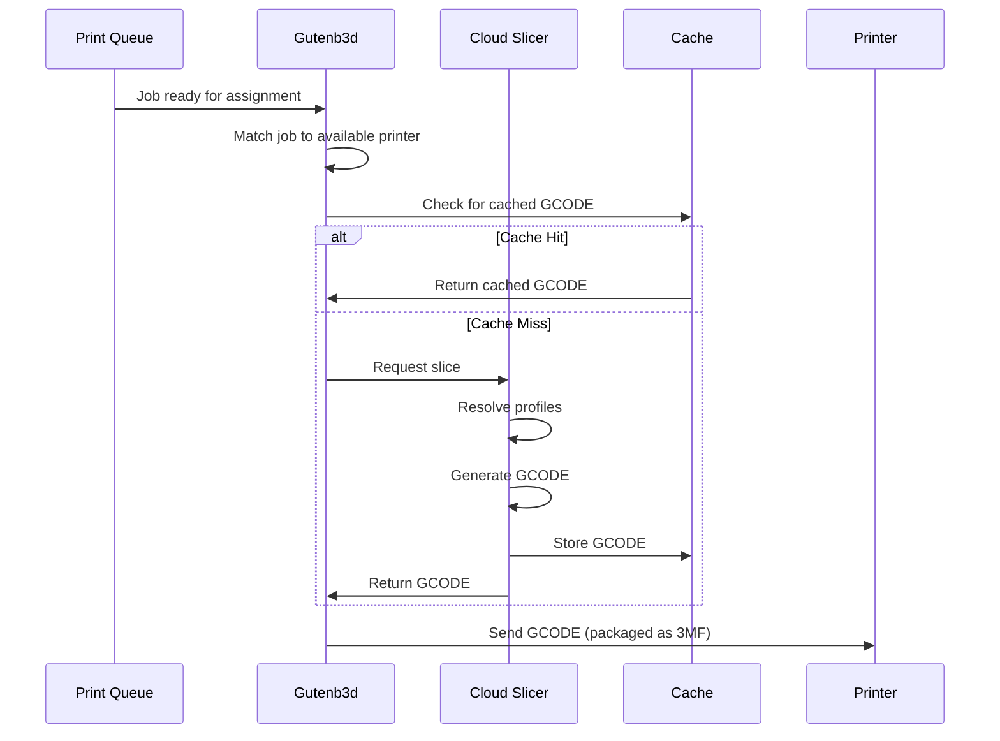

# Cloud Slicer

Printago's Cloud Slicer enables on-demand GCODE generation, automatically converting your 3D models into printer-specific instructions when jobs are assigned to printers. This eliminates the need to pre-slice files for every printer/material combination and enables universal slicing profiles across your entire printer fleet.

## Key Concepts

- **On-Demand Slicing Workflow**: GCODE is generated just-in-time when Gutenb3d assigns a job to a specific printer -- you never need to pre-slice files
- **Profile Resolution Order**: The Cloud Slicer combines three profile layers: Machine profile (printer hardware), Process profile (quality/behavior), and Material profile (filament parameters), each with its own priority chain
- **Intelligent Caching**: Identical parts with the same settings are cached so subsequent prints slice instantly; any change to the part, printer, or profile triggers a reslice
- **Multiple Slicer Engines**: OrcaSlicer and Bambu Studio are supported today, with PrusaSlicer and SuperSlicer coming soon
- **GCODE as 3MF**: Sliced output is packaged as a 3MF file containing GCODE, thumbnails, and slicing metadata

## How It Works

The Cloud Slicer is triggered automatically by [Gutenb3d](./print-queue-management.md) when a queued job is matched and assigned to a specific printer. This just-in-time approach ensures optimal slicing settings for each printer while maintaining efficient queue processing.

### Slicing Workflow

## Profile Resolution

When slicing a job, the Cloud Slicer combines multiple profile sources to generate optimal printer-specific GCODE:

### 1. Machine Profile
Defines printer-specific settings synchronized from your [Bambu Lab Integration](../printer-setup/bambu-lab-integration.md):
- Printer model and capabilities
- Bed size and type (Smooth PEI, Textured, etc.)
- Nozzle diameter and configuration
- AMS settings and filament handling

### 2. Process Profile
Determines print quality and behavior settings, resolved in this priority order:
1. **Part-specific override** (if configured on the part)
2. **Printer default process profile** (configured in [Printer Management](./printer-management/printer-management.md))

### 3. Material Profile
Provides material-specific slicing parameters resolved in this priority order:
1. **Material Variant's profile override** (if configured on the color variant)
2. **Material's filament profile** (configured in [Materials](/docs/printing/materials.md))
## Intelligent Caching

The Cloud Slicer implements smart caching to optimize performance and reduce slicing time. If anything on the part, printer, build plate, or related settings changes, it triggers a reslice of the file.

:::tip Cache Benefits
Intelligent caching means identical parts with the same settings slice instantly on subsequent prints, dramatically reducing queue processing time for repeat jobs.
:::

## Slicer Selection

Printago supports multiple slicer engines to accommodate different workflows and preferences:

### Available Slicers
- **OrcaSlicer** (Community-driven) - Open-source with advanced optimization features
- **Bambu Studio** (Official Bambu) - Optimized specifically for Bambu Lab printers
- **PrusaSlicer** (Coming Soon) - Official Prusa Research slicer
- **SuperSlicer** (Coming Soon) - Feature-rich PrusaSlicer fork

### Slicer Configuration
- **Default Slicer**: Set your preferred slicer in [Account Settings](../settings/account-settings.md)
- **Per-Part Override**: Choose specific slicers when adding parts to your library
- **Profile Synchronization**: Managed through the [Bambu Lab Integration](../printer-setup/bambu-lab-integration.md) flow
  - Syncs machine, process, and material profiles from your Bambu account
  - Requires "Cloud Sync" enabled in Bambu Studio or Orca Slicer
  - Profiles refresh when running the integration flow

## GCODE Access

After slicing completes, printer-specific GCODE becomes available:

### Download Method
1. **Print Queue Interface**: Click any job thumbnail → `Download GCODE` button

### File Format
GCODE is packaged as a 3MF file containing:
- Printer-specific GCODE instructions
- Print thumbnails for printer display
- Metadata about slicing settings used

## Troubleshooting

### Slicing Failures
If a job fails during slicing, it moves to the "Errored" tab in the Print Queue. Common causes:
- Part too large for printer bed
- Incompatible material/printer combination
- Missing or corrupted slicer profiles

#### Accessing Slicer Logs

To troubleshoot slicing failures, you can view detailed slicer logs:

1. Navigate to the job in the Print Queue (usually in the "Errored" tab)
2. Click on the job to open the job details
3. Click the **"View Slicer Logs"** button (shown as a log icon or button)
4. Review the logs for specific error messages

The slicer logs contain detailed information about what went wrong during the slicing process, including error messages from the slicer engine itself.

:::tip Getting Help
If you can't resolve a slicing issue from the logs, share the logs in our [Discord community](https://discord.gg/RCFA2u99De) for assistance from the team and community members.
:::

### Profile Issues
Ensure your slicer profiles are current by either running the [Bambu Lab Integration](../printer-setup/bambu-lab-integration.md) flow to refresh cloud-synced profiles, or [importing profiles manually](./import-profiles.md) from Bambu Studio or OrcaSlicer.

### Unexpected Slicing Results
- Verify the correct slicer version is selected on the profiles being used (Machine, Process, and Material) -- a slicer update may have changed inherited base values
- Check that the Material profile matches the printer model and nozzle diameter in use
- Confirm the Process profile priority: a part-specific override takes precedence over the printer's default process profile

## FAQ

**Q: Do I need to slice files before sending them to the queue?**
A: No. The Cloud Slicer generates GCODE automatically when a job is assigned to a printer. You only need to upload your 3D model (STL, STEP, 3MF, or SCAD).

**Q: When does the cache get invalidated?**
A: Any change to the part geometry, printer configuration, material profile, process profile, or build plate settings will trigger a fresh reslice. If nothing has changed, the cached GCODE is reused instantly.

**Q: Can I download the GCODE that was sent to the printer?**
A: Yes. After slicing completes, click the job thumbnail in the Print Queue and use the "Download GCODE" button. The file is a 3MF containing the GCODE, thumbnails, and metadata.

**Q: How do I switch between OrcaSlicer and Bambu Studio?**
A: Set your preferred default slicer in [Account Settings](../settings/account-settings.md). You can also override the slicer on a per-part basis when adding parts to your library.

**Q: What happens if slicing fails?**
A: The job moves to the "Errored" tab in the Print Queue. Open the job details and click "View Slicer Logs" to see the specific error from the slicer engine.

Need help? Join our [Discord community](https://discord.gg/RCFA2u99De) for latest info and support!
