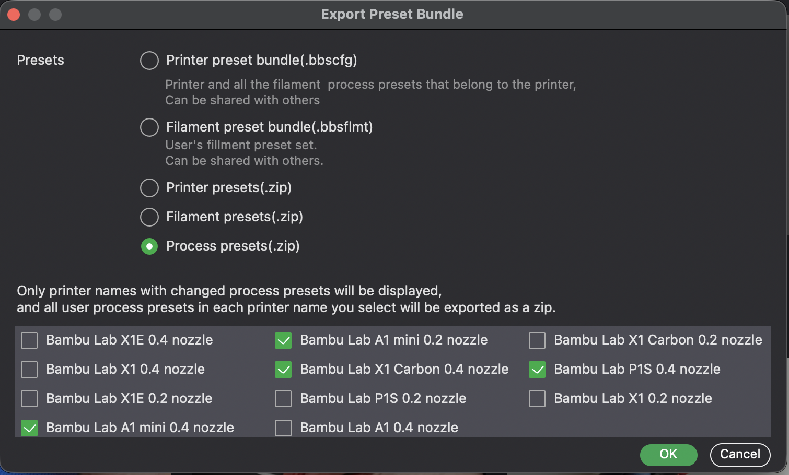
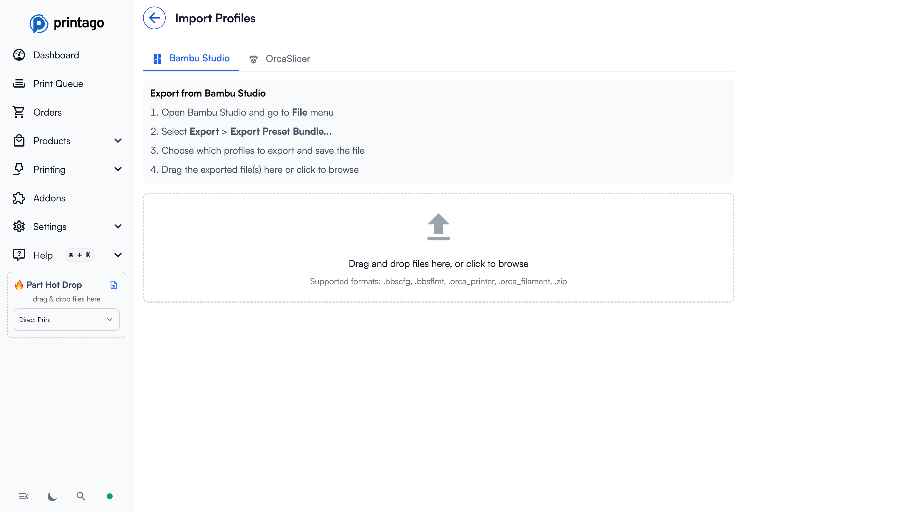
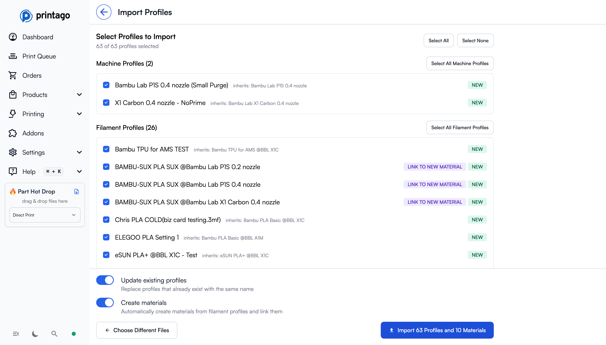
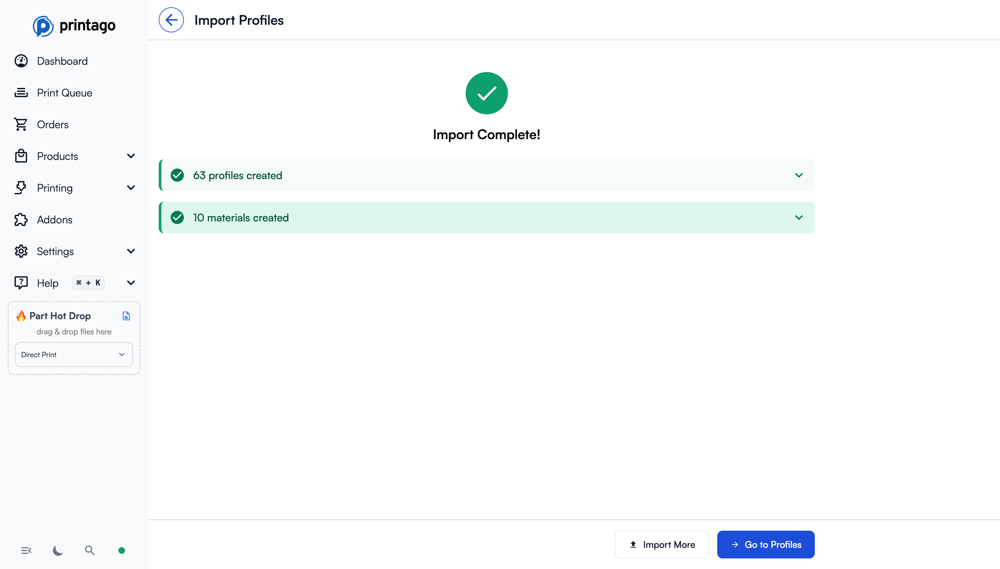

# Importing Profiles Manually

In addition to syncing profiles via the [Bambu Lab Integration](../printer-setup/bambu-lab-integration.md), you can manually import slicer profiles directly from Bambu Studio or OrcaSlicer. This is useful when you want to:

- Import custom profiles that aren't synced to the cloud
- Keep specific profiles without enabling cloud sync
- Import profiles from OrcaSlicer directly, since there can be minor differences

## Key Concepts

- **Supported Formats** -- Printago accepts `.bbscfg`, `.bbsflmt`, `.orca_printer`, `.orca_filament`, and `.zip` archives containing any of these.
- **Profile Categories** -- Imported profiles are organized into three types: Machine Profiles (printer settings), Filament Profiles (material settings), and Process Profiles (print quality settings).
- **Import Process** -- Upload files, review discovered profiles with status badges (New, Update, No Change), select which profiles to import, and confirm.
- **Duplicate Handling** -- If the same profile appears in multiple uploaded files, only the first occurrence is used. Existing profiles can be updated or skipped.
- **Material Creation** -- Filament profile imports can optionally create corresponding materials in your inventory, linked to the profiles for AMS compatibility.

## Supported File Formats

Printago supports importing the following file types:

| Format | Description |
|--------|-------------|
| `.bbscfg` | Bambu Studio configuration bundle |
| `.bbsflmt` | Bambu Studio filament preset |
| `.orca_printer` | OrcaSlicer printer preset |
| `.orca_filament` | OrcaSlicer filament preset |
| `.zip` | ZIP archive containing any of the above |

## Step 1: Export Profiles from Your Slicer

### Exporting from Bambu Studio and OrcaSlicer

The instructions for Bambu Studio and OrcaSlicer are essentially the same.

1. Open Bambu Studio and go to the **File** menu
2. Select **Export** > **Export Preset Bundle...**
3. Choose which profiles to export (machine, filament, and/or process profiles)
4. Save the exported file(s) to your computer

## Step 2: Upload to Printago

Navigate to **Printing** > **Profiles** and click **Import Profiles** (or go directly to `/profiles/new`).

You can upload files in two ways:
- **Drag and drop** files directly onto the upload zone
- **Click to browse** and select files from your computer

You can upload multiple files at once, including ZIP archives containing multiple presets. Printago will parse all supported files and extract the profiles automatically.  If the same profile appears in multiple files, only the first occurrence is used.

## Step 3: Select Profiles to Import

After uploading, Printago parses the files and displays all discovered profiles organized by type:

### Profile Categories

Profiles are grouped into three categories:

- **Machine Profiles** - Printer-specific settings (bed size, nozzle configuration, etc.)
- **Filament Profiles** - Material settings (temperatures, speeds, cooling, etc.)
- **Process Profiles** - Print quality settings (layer height, infill, supports, etc.)

### Profile Status Badges

Each profile shows a status badge:

| Badge | Meaning |
|-------|---------|
| **New** | This profile doesn't exist in Printago yet |
| **Update** | A profile with this name already exists and will be updated |
| **No Change** | The profile is identical to an existing one (cannot be selected) |
| **Link to New Material** | This filament profile will be linked to the custom material after creation |

### Selection Controls

- **Select All / Select None** - Toggle all selectable profiles
- **Select All [Type] Profiles** - Select all profiles of a specific type
- Individual checkboxes to select specific profiles

### New Materials Section

When importing filament profiles, Printago can automatically create corresponding materials in your inventory. The **New Materials** section shows:

- Material name and type (PLA, PETG, etc.)
- Material identifier (used for AMS matching)
- Compatible printer models

### Import Options

At the bottom of the page, you'll find two toggles:

- **Update existing profiles** - When enabled, profiles with matching names will be replaced with the imported version. When disabled, only new profiles are imported.
- **Create materials** - When enabled, new materials are automatically created from filament profiles and linked to them. This is useful for AMS compatibility and ease of importing your custom materials.

## Step 4: Complete Import

Click the **Import** button to import your selected profiles. You'll see a summary showing:

- Number of profiles created
- Number of profiles updated (if any)
- Number of materials created (if enabled)

From here you can:
- **Import More** - Start another import
- **Go to Profiles** - View your imported profiles

## Tips

- **Bulk Import**: You can drag and drop entire folders of preset files, and Printago will recursively find and parse all supported files.
- **Duplicate Handling**: If the same profile appears in multiple files, only the first occurrence is used.
- **Profile Inheritance**: Profiles that inherit from built-in Bambu/Orca profiles will show the parent profile name for reference.
- **Filament Profile Linking**: When you import filament profiles with "Create materials" enabled, the profiles are automatically linked to the corresponding material.

## Troubleshooting

### Import Fails or No Profiles Found

1. Verify the file format is supported (`.bbscfg`, `.bbsflmt`, `.orca_printer`, `.orca_filament`, or `.zip`)
2. If uploading a ZIP, ensure it contains supported profile files -- nested folders within the ZIP are scanned automatically
3. Try exporting the profiles again from your slicer, as the file may be corrupted

### All Profiles Show "No Change"

This means every profile in the uploaded file already exists in Printago with identical settings. If you expected updates, verify you exported the correct (modified) profiles from your slicer.

### Imported Profiles Not Appearing in Printer Configuration

1. Check that you imported the correct profile type (Machine, Filament, or Process) for what you need
2. Verify the profile is compatible with the printer model you are configuring
3. Navigate to **Printing** > **Profiles** to confirm the profiles were imported successfully

## FAQ

**Q: Can I import OrcaSlicer profiles into Printago?**
A: Yes. Printago supports `.orca_printer` and `.orca_filament` formats, as well as OrcaSlicer configuration bundles in ZIP archives.

**Q: What happens if I import a profile with the same name as an existing one?**
A: If "Update existing profiles" is enabled, the existing profile will be replaced with the imported version. If disabled, the import will skip that profile.

**Q: Can I import multiple files at once?**
A: Yes. You can drag and drop multiple files (or entire folders) onto the upload zone, and Printago will parse all supported files and extract profiles from each.

**Q: Do I need to import profiles, or can I use cloud sync instead?**
A: You can do either. The [Bambu Lab Integration](../printer-setup/bambu-lab-integration.md) flow syncs cloud profiles automatically. Manual import is for custom profiles or OrcaSlicer-specific profiles that are not available through cloud sync.

**Q: Will importing filament profiles automatically set up my materials?**
A: Only if you enable the "Create materials" toggle during import. When enabled, Printago will create corresponding materials in your inventory and link them to the imported filament profiles.
