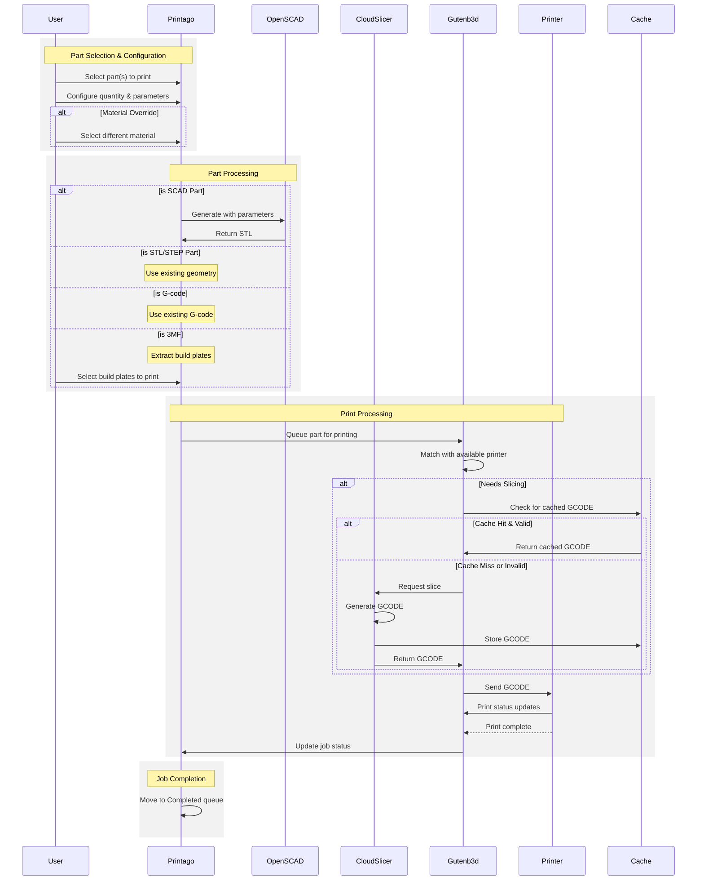

# Printing Parts

This page covers how to print parts from your library.  To learn more about how to add and manage parts, check out [Parts Management](/docs/products/part-management.md)

## Key Concepts

- **Assignment Methods**: Choose how jobs are routed to printers -- Next Available, Specific Printer, or Tagged Printers
- **Supported Part Types**: STL, 3MF (with build plate selection), OpenSCAD (.scad with parameters), STEP, and pre-sliced G-code
- **Queue Priority**: Jobs can be Normal (default) or Low priority; low priority jobs only process when the normal queue is empty
- **Material Override**: A part's default material can be overridden at print time for flexibility
- **Bulk Printing**: Select multiple parts and configure them together in a single dialog
- **Smart Matching**: Gutenb3d automatically matches queued jobs to compatible printers based on material, color, tags, and availability

## Starting a Print

### Single Part Printing
1. Navigate to `Products -> Parts`
2. Find your part and click the `Send to Queue` button
3. Configure your print settings:
   - Set quantity
   - Configure OpenSCAD parameters (if applicable)
   - Select material (the part's default material may be overridden)
   - **Priority**: Use the toggle button to the left of "Send to Queue" to mark jobs as low priority (optional)
4. Choose printer [Assignment Method](#assignment-methods)

### **Queue Priority Options**
- **Normal Priority** (default): Jobs process immediately when printers are available
- **Low Priority**: Jobs only process when no normal priority jobs are waiting

After queuing, job priority can be adjusted from the [Print Queue Management](/docs/printing/print-queue-management) interface.

### STL Parts

STL parts are ready to print with quantity and material selection.

### 3MF Files
When printing 3MF files:
- Select which build plates to print from the available options
- Toggle between "editing each" and "editing all" modes
- In "editing all" mode, changing one build plate's quantity adjusts all build plates proportionally

### OpenSCAD Parts (.scad)

OpenSCAD parts display parameter inputs for customization before printing.

### Bulk Printing
You can select multiple parts and print them together:

1. Select multiple parts using checkboxes
2. Choose `Print` from the Bulk Actions menu

3. A dialog opens with each selected part in an accordion format
4. Configure each part individually:
   - Set quantities
   - Adjust parameters
   - Select materials

## Printer Assignment

When starting a print, you can target specific printers or let Printago handle printer selection automatically. Every print job enters the Print Queue, and starts when matching printers become available.
1. Search for Individual Printers
2. Automatic Assignment
3. Individual Printer List

### Assignment Methods

#### Next Available
Lets Printago automatically match jobs to compatible printers based on:
- Material requirements 
- Color matching
- Current printer status

#### Specific Printer 
Target an individual printer from your fleet. The job waits in queue until that printer:
- Has required materials loaded
- Is marked Clear & Ready
- Has no active prints

#### Tagged Printers
Filter available printers using tags to dynamically group printers. For example:
- Target any printers with tag "Production"
- Only use printers tagged both "Upper Floor" and "TexturedPEI"
- [Learn more about Printer Tags](/docs/printing/printer-management/printer-tags.md)

### State Diagram
The following diagram shows the part printing flow.

## Troubleshooting

**Job stays in Queued and never starts printing:**
- Verify at least one printer has the required material loaded and assigned
- Check that the target printer is marked "Clear & Ready" -- jobs will not start on printers that haven't been confirmed ready
- If using Tagged Printers, ensure at least one ready printer has **all** the selected tags
- Open the job's `Printer Matching` dialog in the Print Queue to see exactly why each printer was skipped

**Wrong material or color used:**
- Confirm the correct material variant is assigned to the printer's AMS slot or external spool
- When using "Any Color" matching with multi-color 3MF files, all slots may resolve to the same spool -- assign specific variants instead

**OpenSCAD part fails to generate:**
- Double-check parameter values for typos or out-of-range numbers
- Ensure the .scad file renders successfully in OpenSCAD locally before uploading

:::tip Quick Diagnosis
Every queued job has a **Printer Matching** dialog that lists each printer and the specific reason it did or did not match. This is the fastest way to diagnose assignment issues.
:::

## FAQ

**Q: Can I change a job's priority after it has been queued?**
A: Yes. Open the [Print Queue Management](./print-queue-management.md) interface, select the job, and use the multi-action dropdown to switch between Normal and Low priority.

**Q: What happens if I print a 3MF with multiple build plates?**
A: Each selected build plate becomes a separate queue item. You can toggle between "editing each" and "editing all" modes to set quantities individually or proportionally.

**Q: Can I override the material for a single part inside a bulk print?**
A: Yes. The bulk printing dialog shows each part in an accordion format where you can configure quantity, parameters, and material independently.

**Q: Does "Next Available" consider printer wear or usage history?**
A: Gutenb3d processes printers on a "last-used" basis to distribute wear evenly across your fleet, so less recently used printers are preferred.

**Q: Is there a limit to how many parts I can bulk-print at once?**
A: There is no hard limit on the number of parts you can select for bulk printing, but each part creates a separate queue item that consumes a production slot when it starts.

## Next Steps

After printing parts, they are added to the print queue where they are matched with available printers. For more information about how parts are matched with printers and queue management, see [Print Queue Management](./print-queue-management.md).
