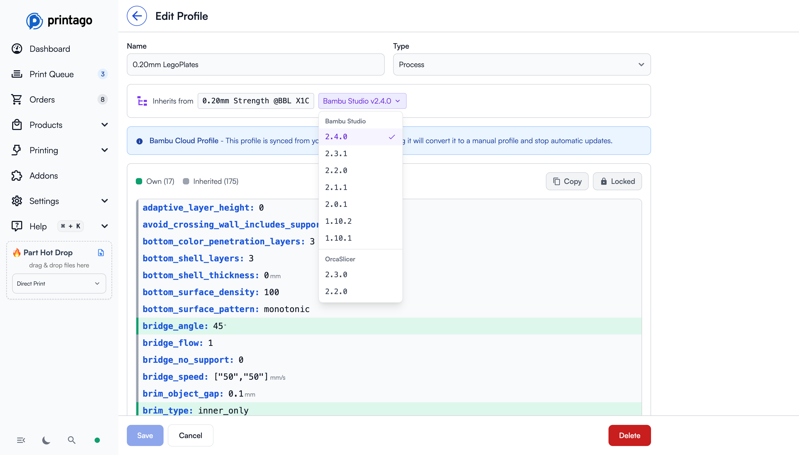

# Slicer Profiles

Your slicer profiles page displays a comprehensive list of all your profiles, including those synced from your Bambu Lab account and any you've imported manually.

## Key Concepts

- **Profile Types**: Printago uses three profile categories -- Machine (printer hardware settings), Process (print quality/behavior), and Material (filament-specific parameters)
- **Inheritance**: Most profiles inherit default values from a base profile; your custom overrides ("Own") take precedence over inherited values
- **Slicer Versions**: Printago maintains base profiles from multiple Bambu Studio and OrcaSlicer releases -- you can choose which version supplies the inherited values
- **Cloud Sync vs. Manual Import**: Profiles can be synced automatically from your Bambu Lab account (requires Cloud Sync enabled) or imported manually via preset bundles
- **Profile Locking**: Lock a profile to prevent accidental edits while still allowing it to be used for slicing

## Getting Profiles into Printago

There are two ways to add slicer profiles to Printago:

### Option 1: Bambu Lab Cloud Sync

Run the [**Bambu Lab Integration Flow**](../printer-setup/bambu-lab-integration.md) to sync profiles from your Bambu Lab account. This requires **Cloud Sync** to be enabled in Bambu Studio or OrcaSlicer.

### Option 2: Manual Import

[**Import profiles manually**](./import-profiles.md) by exporting preset bundles from Bambu Studio or OrcaSlicer and uploading them directly to Printago. This works without cloud sync and gives you control over exactly which profiles to import.

## Managing Your Profiles

### Searching Profiles
You can search through your profile list to quickly narrow down and find specific profiles.

### Deleting Profiles
Profiles can be deleted directly from the Printago interface. However, note that:
- Deleting profiles from your Bambu account alone **won't** delete them from Printago
- You must delete them from within Printago to remove them from your list

## Editing Profiles

Click on any profile to open the edit view, where you can:

- **Rename** the profile
- **View all settings** including both your custom overrides ("Own") and inherited values from the base profile ("Inherited")
- **Copy** settings to clipboard
- **Lock** the profile to prevent accidental changes

### Profile Inheritance and Slicer Versions

Most profiles inherit from a base profile (e.g., `0.20mm Strength @BBL X1C`). Printago maintains multiple versions of these base profiles from different slicer releases.

Use the **slicer version dropdown** to:

- **Compare inherited values** across different Bambu Studio and OrcaSlicer versions
- **Select which slicer version** the inherited values should come from when cloud slicing

This is useful when:
- A newer slicer version changed default settings you relied on
- You want to use OrcaSlicer's interpretation of a profile instead of Bambu Studio's
- You need to troubleshoot differences in slicing behavior between versions

The selected slicer version determines which base profile values are used when the [Cloud Slicer](./cloud-slicer.md) generates GCODE for your prints

## Troubleshooting

**Profiles not appearing after Bambu Lab Cloud Sync:**
- Ensure "Auto sync user presets" is enabled in your slicer's Preferences -> Presets
- Close Bambu Studio or OrcaSlicer completely before running the integration flow -- the slicer can hold locks on profile data
- Wait 30 seconds after saving changes in the slicer for Bambu's cloud to propagate, then re-run the integration

**Unexpected slicing results after a slicer update:**
- A newer slicer version may have changed inherited base profile values you relied on
- Open the profile in Printago, use the slicer version dropdown to compare inherited values across versions, and select the version that matches your expectations

**Deleted a profile from Bambu account but it still appears in Printago:**
- Deleting profiles from your Bambu account does **not** remove them from Printago
- You must delete them directly from the Printago Slicer Profiles page

:::tip Version Comparison
Use the slicer version dropdown on any profile to quickly compare how inherited values differ between Bambu Studio and OrcaSlicer releases. This is invaluable when diagnosing why a print behaves differently after a slicer update.
:::

## FAQ

**Q: What is the difference between "Own" and "Inherited" values on a profile?**
A: "Own" values are your custom overrides that you explicitly set. "Inherited" values come from the base profile and slicer version you selected. Your own values always take precedence.

**Q: Can I use OrcaSlicer profiles instead of Bambu Studio profiles?**
A: Yes. Use the slicer version dropdown on any profile to switch the inherited base to an OrcaSlicer release. You can also import OrcaSlicer preset bundles directly via the manual import flow.

**Q: Do I need to re-sync profiles every time I update my slicer?**
A: Only if you want the updated base profile values. Your custom overrides are preserved. Re-running the integration flow will pick up any new or changed profiles from your Bambu account.

**Q: Can I copy a profile to use as a starting point for a new one?**
A: You can copy profile settings to the clipboard from the edit view, but creating a derived profile should be done in your slicer (Bambu Studio or OrcaSlicer) and then synced or imported into Printago.

**Q: What does locking a profile do?**
A: Locking prevents accidental edits to the profile within Printago. The profile remains fully usable for slicing -- it just cannot be modified until you unlock it.
